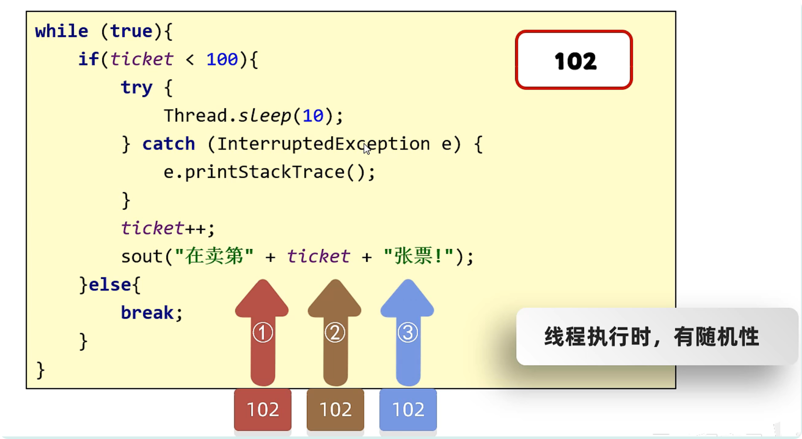
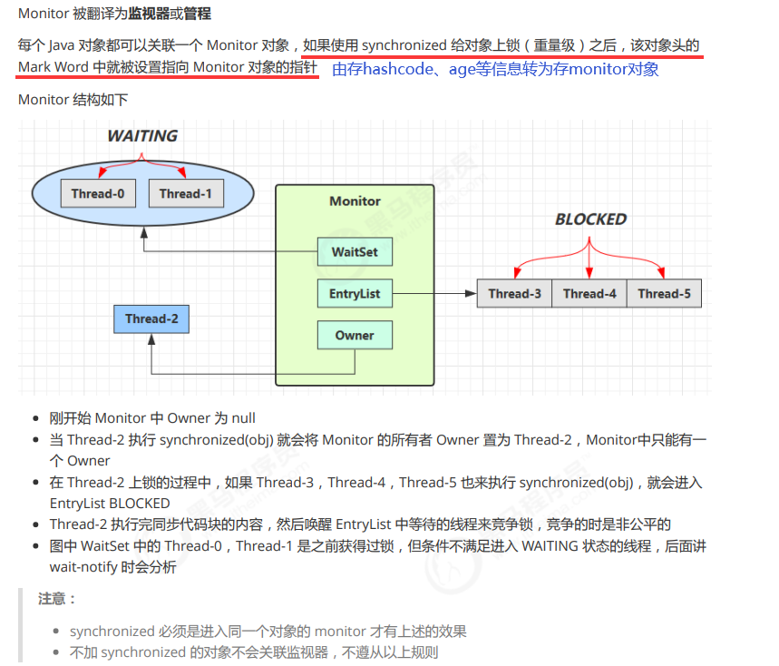

# Java 并发编程

## 1. 简介

### 1.1 概念

- 有了多线程，我们就可以让程序同时做多件事情。

### 1.2 目的

- 实现异步操作；
- 提升效率（单核 CPU 不能提升效率，因为其本质上还是线程串行执行）。

### 1.3 使用说明

多线程能否提高程序运行效率还是要分情况的：

- `设计角度`：有些任务，经过精心设计，将任务拆分，并行执行，当然可以提高程序的运行效率。但并不是所有计算任务都能拆分（参考阿姆达尔定律）；也不是所有任务都需要拆分，任务的目的如果不同，谈拆分和效率没啥意义

- `IO 角度`：IO 操作不占用 cpu，只是我们一般拷贝文件使用的是【阻塞 IO】，这时相当于线程虽然不用 cpu，但需要一直等待 IO 结束，没能充分利用线程。所以才有后面的【非阻塞 IO】和【异步 IO】优化。

### 1.4 并发与并行

- `并发`：在同一时刻，有多个指令在 CPU 上交替执行；
- `并行`：在同一时刻，有多个指令在 CPU 上同时执行。

- `进程通信`：同一台计算机的进程通信称为 IPC(Iner-process communication)；不同计算机之间的进程通信需要通过网络，并遵守共同的协议，例如 HTTP；
- `线程通信`：共享进程内的内存，一个例子是多个线程可以访问同一个共享变量；线程更轻量，线程上下文切换成本一般要比进程上下文切换低。

### 1.5 线程上下文切换（Thread Context Switch）

因为以下一些原因导致 cpu 不再执行当前的线程，转而执行另一个线程的代码：

- 线程的 cpu 时间片用完；
- 垃圾回收 ；
- 有更高优先级的线程需要运行
- 线程自己调用了 sleep、yield、wait、join、park、synchronized、lock 等方法

当 Context Switch 发生时，需要由操作系统保存当前线程的状态，并恢复另一个线程的状态（这个状态包括程序计数器、虚拟机栈中每个栈帧的信息，如局部变量、操作数栈、返回地址），对应 Java 中的概念就是程序计数器，它的作用是记住下一条 jvm 指令的执行地址，是线程私有的 。

:::warning Context Switch 频繁发生会影响性能
:::

## 2. 创建线程

### 方式一：继承 Thread 类

```java:collapsed-lines=2
//1. 创建线程类继承 Thread，重写 run 方法
public class MyThread extends Thread{
  @Override
  public void run() {
  // 线程执行逻辑
  for (int i = 0; i < 100; i++) {
    System.out.println(getName() + "helloWorld");
  }

  public static void main(String[] args) {
        //2. 创建线程、设置线程名、启动线程
        Thread t1 = new MyThread();
        Thread t2 = new MyThread();
        t1.setName("线程1: ");
        t2.setName("线程2: ");

        t1.start();
        t2.start();
  }
}
```

### 方式二：实现 Runnable 接口

```java:collapsed-lines=2
//1. 创建类实现Runnable接口，重写run方法
public class MyRunnable implements Runnable{
   @Override
   public void run() {
       for (int i = 0; i < 100; i++) {
           System.out.println(Thread.currentThread().getName() + ": HelloWorld");
       }
   }
}
```

```java:collapsed-lines=2
public class Main {
    public static void main(String[] args) {
        //2. 创建Runnable实现类对象，用于创建线程对象
        Runnable myRunnable = new MyRunnable();

        //3. 创建线程对象，启动方法
        Thread t1 = new Thread(myRunnable);
        Thread t2 = new Thread(myRunnable);
        t1.setName("线程1");
        t2.setName("线程2");

        t1.start();
        t2.start();
    }
}
```

### 方式三：实现 Callable 接口

- 原理是保护性暂停设计模式。get 方法会阻塞等待线程执行完毕从而拿到执行结果

```java:collapsed-lines=2
//1. 创建类实现Callable接口，泛型为返回值类型
public class MyCallable implements Callable<Integer> {
    @Override
    public Integer call() throws Exception {
        //线程执行逻辑: 1-100累加
        int sum = 0;
        for (int i = 1; i <= 100; i++) {
            sum += i;
        }
        return sum;
    }
}
```

```java:collapsed-lines=2
import java.util.concurrent.Callable;
import java.util.concurrent.ExecutionException;
import java.util.concurrent.FutureTask;

public class Main {
    public static void main(String[] args) throws ExecutionException, InterruptedException {
        //2. 创建Callable实现类对象
        MyCallable callable = new MyCallable();

        //3. 创建FutureTask对象，多个线程就创建多个
        FutureTask<Integer> future1 = new FutureTask<>(callable);
        FutureTask<Integer> future2 = new FutureTask<>(callable);

        //4. 创建Thread对象，多个线程就创建多个，启动线程
        Thread t1 = new Thread(future1);
        Thread t2 = new Thread(future2);
        t1.start();
        t2.start();

        //5. 调用get方法获取返回值
        System.out.println("线程1执行结果" + future1.get());
        System.out.println("线程2执行结果" + future2.get());
    }
}
```

**_三种方式的优缺点：_**
<c-table
  :columns="[
    { title: '', key: 'compare', width: '155px' },
    { title: '优点', key: 'advantage' },
    { title: '缺点', key: 'disadvantage' }
  ]"
  :data="[
    { compare: '继承Thread类', advantage: '编程比较简单，可以直接使用Thread类中的方法', disadvantage: '扩展性较差，不能再继承其他的类' },
    { compare: '实现Runnable接口', advantage: '扩展性强，实现该接口的同时还可以继承其他的类', disadvantage: '编程相对复杂，不能直接使用Thread类中的方法' },
    { compare: '实现Callable接口', advantage: '', disadvantage: '' }
  ]"
  :mergeConfig="{
    advantage: [
      { row: 1, rowspan: 2, colspan: 1 }
    ],
    disadvantage: [
      { row: 1, rowspan: 2, colspan: 1 }
    ],
  }"
/>

:::tip coding 注意事项

- 线程一旦启动后就交给操作系统处理，会立马向下执行下一条代码
- 判断线程执行完毕的方法：线程对象的 run 方法执行完毕（在 run 方法末尾加善后工作）

:::

## 3. Thread 类 API

**_(1). 设置线程名/获取线程名_**

:::details getName setName

- `String getName()`：返回此线程的名称
- `void setName(String name)`：设置线程的名字（构造方法也可以设置名字）
- **细节**：
  1. 如果我们没有给线程设置名字，线程也是有默认的名字的，格式：Thread-X（X 序号，从 0 开始的）
  2. 如果我们要给线程设置名字，可以用 set 方法进行设置，也可以构造方法设置

:::

**_(2). 获取当前线程对象_**

:::details currentThread

- `static Thread currentThread()`：获取当前线程的对象
- **细节**：
  当 JVM 虚拟机启动之后，会自动的启动多条线程，其中有一条线程就叫做 main 线程，他的作用就是去调用 main 方法，并执行里面的代码，在以前，我们写的所有的代码，其实都是运行在 main 线程当中

:::
**_(3). 线程休眠_**

:::details sleep & TimeUnit

- `static void sleep(long time)`：让线程休眠指定的时间，单位为毫秒
- **细节**：
  1. 哪条线程执行到这个方法，那么哪条线程就会在这里停留对应的时间
  2. 方法的参数：就表示睡眠的时间，单位毫秒，1 秒 = 1000 毫秒
  3. 当时间到了之后，线程会自动的醒来，继续执行下面的其他代码
- **补充**：
  1. sleep 要写在同步代码外效果才明显
  2. 由 runnable（就绪或运行状态） --> Time_Waiting（计时等待） --> （睡眠结束）runnable
  3. 被 interrupt()方法打断后抛出 InterruptedException 异常（一般捕获）
  4. 可以使用 TimeUnit.SECOND.sleep(1) 替代 Thread.sleep(1000)，可以指定单位，可读性更好

:::
**_(4). 线程优先级_**

:::details setPriority & getPriority

- `setPriority(int newPriority)`：设置线程的优先级
- `final int getPriority()`：获取线程的优先级
- **要点**：
  - 线程优先级会提示（hint）调度器优先调度该线程，但它仅仅是一个提示，调度器可以忽略它
  - 如果 cpu 比较忙，那么优先级高的线程会获得更多的时间片，但 cpu 闲时，优先级几乎没作用

:::
**_(5). 守护线程_**

:::details setDaemon

- `final void setDaemon(boolean on)`：设置为守护线程
- **细节**：当其他的非守护线程执行完毕之后，守护线程会陆续结束
- **通俗理解**：当女神线程结束了，那么备胎也没有存在的必要了
- **原理及应用**：
  1. 默认情况下，Java 进程需要等待所有线程都运行结束，才会结束
  2. 当非守护线程执行完后守护线程将终止执行
  3. **应用**：
     - 垃圾回收器线程就是一种守护线程，当所有 java 线程执行完毕后，就没有 GC 的必要了
     - Tomcat 中的 Acceptor 和 Poller 线程都是守护线程，所以 Tomcat 接收到 shutdown 命令后，不会等待它们处理完当前请求

:::
**_(6). 出让/礼让线程_**

:::details yield

- `public static void yield()`：出让线程/礼让线程
- **说明**：会让当前线程从运行状态变为就绪状态，具体的实现依赖于操作系统的任务调度器

:::
**_(7). 插队线程_**

:::details join

- `public final void join()`：插入线程/插队线程
- **要点**：
  1. `join(n)`：最多等待 n 毫秒
  2. 在线程 2 中调用线程 1 的 join 方法，线程 2 会等待线程 1 执行完后才执行
  3. **应用**：实现线程的同步

:::
**_(8). 启动线程_**

:::details start

- **实例方法**：启动线程

:::
**_(9). 获取线程状态_**

:::details getStatus

- **获取线程状态**：Java 中线程状态是用 6 个 enum 表示，分别为：NEW, RUNNABLE, BLOCKED, WAITING, TIMED\*WAITING, TERMINATED

:::

**_(10). 线程打断相关 API_**

:::details interrupt

- **打断阻塞线程**
  - 抛出 InterruptedException
  - 清空打断标记（此时调用 `isInterrupted() = false`）
- **打断正常线程和 park 线程**
  - 此时调用 `isInterrupted() = true`，被打断的线程可根据此条件决定线程的下一步操作

:::

:::details interrupted & isInterrupted

- 调用`Thread.interrupted()`后返回打断标记，并清除打断状态（此时调用`isInterrupted = false`）
- 调用当前线程对象的`isInterrupted()`后返回打断标记，不会清除打断状态

:::

:::details park & unpark

- **使用**

  - 暂停当前线程：`LockSupport.park();`
  - 恢复某个线程的运行：`LockSupport.unpark(暂停线程对象)`

- **与 interrupted 的联系**

  - 调用`interrupt`方法打断被`LockSupport.park()`的线程不会清空打断状态（`isInterrupted = true`）
  - 当打断状态为`true`时再执行`park`方法将失效，若想生效则可以调用`Thread.interrupted()`将打断标记设为`false`

- **与 wait、notify 的联系**

  - `wait`，`notify`和`notifyAll`必须配合`Object Monitor`一起使用，而`park`，`unpark`不必
  - `park & unpark`是以线程为单位来【阻塞】和【唤醒】线程，而`notify`只能随机唤醒一个等待线程，`notifyAll`是唤醒所有等待线程，就不那么【精确】
  - `park & unpark`可以先`unpark`，而`wait & notify`不能先`notify`

:::

::: warning 不推荐使用的 API
还有一些不推荐使用的方法，这些方法已过时，容易破坏同步代码块，造成线程死锁

<c-table
  style="width: 100%; table-layout: fixed;"
  :columns="[
    { title: '方法名', key: 'name' },
    { title: '功能说明', key: 'desc' }
  ]"
  :data="[
    { name: 'stop()', desc: '停止线程运行' },
    { name: 'suspend()', desc: '挂起（暂停）线程运行' },
    { name: 'resume()', desc: '恢复线程运行' }
  ]"
/>
:::

## 4. 线程生命周期

生命周期对应 6 个状态（根据 JUC 中的枚举类），其中运行表示线程交给操作系统执行，在 JVM 中无定义


:::tip

- java 中 runnable 包括就绪状态和运行状态；
- 调用 wait 方法进入阻塞前会释放锁，而 sleep 和 join 不会；
- 如果调用了阻塞 API，如 BIO 读写文件，这时该线程实际不会用到 CPU，会导致线程上下文切换，进入【阻塞状态】（操作系统层面）;但由于 BIO 导致的线程阻塞，在 Java 里无法区分，仍然认为是 runnable 状态。

:::

## 5. 线程安全

### 1. 简介

`产生线程安全问题的根本`：多个线程同时对共享资源进行读写操作时因线程上下文切换而发生的指令交错。

`临界区`：一段代码块内如果存在对共享资源的多线程读写操作，称这段代码块为临界区。

`竞态条件`： 多个线程在临界区内执行，因代码执行序列不同导致结果无法预测，称之为发生了竞态条件。

线程安全解决方案：

- `阻塞式解决`：包括 synchronized、各种互斥锁等（ReentryLock）。
- `非阻塞时解决`：使用原子变量。

### 2. 常见线程安全类

::: details 不可变类（状态创建后不可修改）

- String
- Integer、Long、Double 等基本类型包装类
- BigInteger、BigDecimal（java.math 包）
- LocalDate、LocalTime 等（Java 8 时间 API）
- File（文件路径不可变）

:::

::: details 同步类（基于 synchronized 关键字）

- StringBuffer
- Vector（同步的 List 实现）
- Hashtable（同步的 Map 实现）
- Properties（继承自 Hashtable）
- Collections.synchronizedXXX()，如：Collections.synchronizedList()、synchronizedMap()等包装类。

:::

::: details JUC 包下的高效线程安全类（基于 CAS、分段锁、无锁算法等实现的高并发类）

`集合类：`

- ConcurrentHashMap（分段锁/CAS，替代 Hashtable）
- CopyOnWriteArrayList（写时复制，适合读多写少）
- CopyOnWriteArraySet
- BlockingQueue 接口及其实现（如 ArrayBlockingQueue、LinkedBlockingQueue）

`原子类（java.util.concurrent.atomic）`：

- AtomicInteger、AtomicLong、AtomicBoolean

- AtomicReference、AtomicStampedReference

- LongAdder、DoubleAdder（高并发计数优化）

`锁与同步工具类：`

- ReentrantLock（可重入锁）
- CountDownLatch、CyclicBarrier、Semaphore
- Exchanger（线程间交换数据）

:::

::: details 其他线程安全类

- ThreadLocal（线程隔离变量，非全局安全但避免竞争）
- Random（线程安全但性能差，推荐用 ThreadLocalRandom）
- javax.servlet.ServletContext（Web 容器中线程安全）

:::

对比：
<c-table 
  :columns="[
    { title: '分类', key: 'category' },
    { title: '特点', key: 'feature' },
    { title: '典型示例', key: 'examples' }
  ]" 
  :data="[
    { 
      category: '不可变类', 
      feature: '无状态修改，天然线程安全', 
      examples: 'String, BigInteger' 
    },
    { 
      category: '同步类（JDK旧）', 
      feature: '方法级 synchronized，性能低', 
      examples: 'Vector, Hashtable' 
    },
    { 
      category: 'JUC包', 
      feature: '高性能并发控制（CAS/分段锁）', 
      examples: 'ConcurrentHashMap' 
    },
    { 
      category: '原子类', 
      feature: '无锁算法（CAS）', 
      examples: 'AtomicLong, LongAdder' 
    },
  ]" 
/>

::: important 这里说的线程安全的类是指，多个线程调用他们`同一个实例的某个方法`时是线程安全的，但调用它们多个方法的组合并不安全，称之为==非原子操作==。

如以下代码：

```java
Hashtable table = new Hashtable<>();
if( table.get("key") == null ) {
  table.put("key", "value");
}
```


:::

### 3. 线程不安全场景

::: details 多个线程读写`非线程安全的`共享变量 (包括静态成员变量、实例成员变量等)

_经典卖票问题：_


:::warning `private`或`final`关键字保证局部变量线程安全
一般情况下方法的 局部变量 是线程安全的（前提是这个方法内部不会创建线程操作局部变量），
但是有一种情况处除外：就是子类重写了这个方法，子类内部会创建线程操作这个局部变量，这样这个局部变量也可能变为共享变量，从而导致线程不安全，因此想让你编写的方法是线程安全的，请使用private或final关键字禁止重写。
*[局部变量]: 包括方法参数和方法内创建的变量

:::


## 6. synchronized

### 6.1. 简介
**`synchronized`** 是java中内置的以悲观锁的方式处理线程安全问题的关键字，其具备以下特性：

  - `可重入性`：同一个线程可以重复获取已经持有的锁

  - `互斥性`：同一时间只有一个线程能持有该锁

  - `保证了可见性`：锁的释放会将对变量的修改刷新到主内存

### 6.2 使用
  1. 同步代码块
  ```java
    synchronized(锁对象){
        // 操作共享数据的代码
    }
  ```
  :::tip 特点

  - 当synchronized代码块中发生异常时会释放锁；
  - 锁可为任意对象，但必须是多个线程可共享的，否则将失去意义（每个线程持有自己的锁，无法实现同步）；
  - 建议使用private final修饰锁对象，避免锁对象被修改，如 private static final Object lock = new Object()。
  
  :::

  2. 同步方法
  ```java
  public class Test {
    // 同步实例方法
    public synchronized void method() {
        // ...
    }
    // 同步静态方法
    public static synchronized void method() {
        // ...
    }

  }
  ```
  等价于：
  ```java
  public class Test {
    // 同步实例方法
    public void method() {
      synchronized(this) {
        // ...
      }
    }
    // 同步静态方法
    public static void method() {
      synchronized(Test.class) {
        // ...
      }
    }

  }
  ```

  :::tip 特点
  - 实例方法锁对象为this、静态方法则为当前类.class
  :::
  
### 6.3 锁升级机制

1. 对象头  
每个 Java 对象在内存中都有一个对象头（Object Header），它存储了对象的元数据信息，如锁状态、GC 分代年龄、哈希码等, 其组成为：

    - `Mark Word (32位JVM大小为4字节，64位JVM大小为8字节)`
    - `Klass Word （大小为4字节）`
    - `array length (数组特有，大小为4字节)`

    :::details 对象头组成图示
      

      Mark Word 结构（64 位 JVM）：
      <c-table 
        :columns="[
          { title: '锁状态', key: 'lockStatus', width: '100px' },
          { title: '存储内容（64 bit）', key: 'storageContent' }
        ]" 
        :data="[
          { 
            lockStatus: '无锁', 
            storageContent: 'unused:25 | identity_hashcode:31 | unused:1 | age:4 | biased_lock:1 | lock:2（01）' 
          },
          { 
            lockStatus: '偏向锁', 
            storageContent: 'thread:54 | epoch:2 | unused:1 | age:4 | biased_lock:1 | lock:2（01）' 
          },
          { 
            lockStatus: '轻量级锁', 
            storageContent: '指向栈中 Lock Record 的指针:62 | lock:2（00）' 
          },
          { 
            lockStatus: '重量级锁', 
            storageContent: '指向 Monitor（管程）的指针:62 | lock:2（10）' 
          },
          { 
            lockStatus: 'GC 标记', 
            storageContent: '空（用于垃圾回收）' 
          }
        ]" 
      />

    :::


2. monitor(重量级锁)

  

3. 轻量级锁

:::details （1）设计目的
  如果一个对象虽然有多线程获取同一把锁，但获取的时间是错开的（也就是没有竞争），那么可以使用轻量级锁来优化
:::

:::details （2）上锁流程
  轻量级锁的核心机制是 CAS（Compare-And-Swap）自旋，适用于 低竞争场景。其加锁流程如下：

  （1）加锁成功（`无竞争`）
  - 线程在栈帧中创建 Lock Record（锁记录）。

  - 使用 CAS 将对象头的 Mark Word 替换为指向 Lock Record 的指针。

  - 如果成功，线程获得轻量级锁。

  （2）加锁失败（`竞争发生`）
  - 情况①：当前线程再次尝试获取锁（锁重入）
    - JVM 检测到是同一个线程，直接允许重入（在栈帧中添加一个新的 Lock Record，但 Mark Word 不变）。
    - 不会升级锁，因为这是线程内部的递归调用。

  - 情况②：其他线程竞争锁
    - CAS 失败（因为 Mark Word 已被其他线程修改）。
    - JVM 会 膨胀（Inflate）为重量级锁，并让当前线程进入阻塞状态（通过操作系统的互斥量 Mutex 实现）。

  图示：
  

:::

:::details （3）解锁流程

  - 情况①：当退出synchronized 块时如果有取值为null的锁记录（`lock record == null`），表示有重入，这时重置锁记录，表示重入计数减一；
  - 情况②：当退出synchronized 块时没有取值为null的锁记录（`lock record != null`），此时使用cas将Mark Word 的值恢复给对象头：
      - 恢复成功：==解锁成功=={.tip}；
      - 恢复失败：说明轻量级锁正进行锁膨胀或已升级为重量级锁，进入重量级锁解锁流程
:::

:::details （4）锁膨胀
  如果一个对象虽然有多线程获取同一把锁，但获取的时间是错开的（也就是没有竞争），那么可以使用轻量级锁来优化
:::

:::details （5）锁重入
  如果一个对象虽然有多线程获取同一把锁，但获取的时间是错开的（也就是没有竞争），那么可以使用轻量级锁来优化
:::

:::details （6）自旋优化
  如果一个对象虽然有多线程获取同一把锁，但获取的时间是错开的（也就是没有竞争），那么可以使用轻量级锁来优化
:::

  
  - 1.  

        - 

    - 2. 加锁流程

    - 更详细的流程参考 pdf 笔记

    - 3. 解锁流程

    - 1

      - 2

    - 4. 锁膨胀

    - 如果在尝试加轻量级锁的过程中，CAS 操作无法成功，这时一种情况就是有其它线程为此对象加上了轻量级锁 （有竞争），这时需要进行锁膨胀，将轻量级锁变为重量级锁。

      -

      -

    - 5. 锁重入

    -

    - 6. 自旋优化

    - 设计目的

      - 重量级锁竞争的时候，还可以使用自旋来进行优化，如果当前线程自旋成功（即这时候持锁线程已经退出了同步块，释放了锁），这时当前线程就可以避免阻塞，从而避免上下文切换，提高性能

      - 执行流程

      - 自旋失败的情况

        - 自旋成功的情况

      - 注意事项

      -

      - 自旋次数

      - HotSpot JVM 中，自旋次数默认是 10 次

  - 偏向锁

  - 设计目的

    - Java 6 中引入了偏向锁来做进一步优化：只有第一次使用 CAS 将线程 ID 设置到对象的 Mark Word 头，之后发现这个线程 ID 是自己的就表示没有竞争，不用重新 CAS（因为对象头不变）。以后只要不发生竞争，这个对象就归该线程所有，因此得名偏向锁

    - 对比轻量级锁

    - -

    - 加锁流程

    - - 处于偏向锁的对象解锁后，线程 id 仍存储于对象头中

    - 撤销锁情况

    - 1.  调用了对象的 hashCode。偏向锁的对象 MarkWord 中存储的是线程 id，如果调用 hashCode 会导致偏向锁被撤销。
          轻量级锁会在锁记录中记录 hashCode； 重量级锁会在 Monitor 中记录 hashCode；

      - 2.  当有其它线程使用偏向锁对象时，会将偏向锁升级为轻量级锁

      - 3.  调用 wait/notify

    - 批量重偏向

    -

    - 批量撤销

    -

    - 注意事项

    -

  - 锁消除优化

  - 有时候没有必要对代码块添加 synchronized（如对局部变量做保护），JIT 会将锁优化掉，相当于消除了 synchronized 关键字。

  - synchronized
    上锁总体流程

  -

### 4. volatile

- 1.  简介及使用

- 它可以用来修饰成员变量和静态成员变量，他可以避免线程从自己的工作缓存中查找变量的值，必须到主存中获取它的值，线程操作 volatile 变量都是直接操作主存

- 应用

- 保证变量可见性

  - 使用前提

    - 1.  共享变量

          - 2.  多线程并发场景

          - 3.  不在临界区（不保证原子性）

      - 使用方式

      - 修饰可能发生不可见的共享变量

  - 禁止指令重排序

- 原理

- - 如何保证可见性

  - 写

    - 读

  - 如何保证有序性

  - 写

    - 读

### 5. 等待唤醒机制

（wait&notify）

- 简介&原理

- 目的

  - 条件不满足时进入等待状态（WAITING），并释放锁供其他线程使用，直到被其他线程唤醒

  - 原理

  -

- 条件

- 1.  需要结合 synchronized 使用，因为当线程被 notify 唤醒后还需要获得其 synchronized 中
      的锁才可往下运行，而不是立即运行

  - 2.  synchronized、wait 和 notify 必须作用于同一个锁对象，
        否则可能会抛出 IllegalMonotorStateException 异常

- API

- obj.wait(long n) 有时限的等待, 到 n 毫秒后结束等待，或是被 notify

- sleep(long n)&wait(long n)

- 1.  sleep 是 Thread 方法，而 wait 是 Object 的方法

  - 2.  sleep 不需要强制和 synchronized 配合使用，但 wait 需要和 synchronized 一起用

  - 3.  sleep 在睡眠的同时，不会释放对象锁的，但 wait 在等待的时候会释放对象锁

  - 4.  他们的状态都是 TIME_WAITING

- 解决 notifyAll 虚假唤醒

- 问题：使用 notifyAll 唤醒了不该唤醒的线程

  - 解决：判断条件由 if 换成 while

### 6. 线程安全四大特性

- 原子性

- 临界区内的代码对外是不可分割的，不会被线程切换所打断

- 活跃性

- 1.  死锁

      - 简介

      - 嵌套使用锁时，可能出现程序不能往下执行的现象（线程 1 持有锁 A，等待锁 B，线程 2 持有锁 B，等待锁 A）

      - 原则

      - 只要不嵌套使用锁，就不会出现死锁

      - 示例

      -

      - 检测死锁工具

      - [jstack](file:D:\java\笔记\并发编程笔记\并发编程笔记\并发编程.pdf)

        - jconsole

  - 2.  活锁

  - 介绍

    - 活锁出现在两个线程互相改变对方的结束条件，最后谁也无法结束

    - 解决

    - 确保两个线程修改共享变量的频率不同

    - 示例

    - 线程 A 每隔 1 秒对共享变量 count--，直到 count >= 0（结束条件）;
      线程 B 每隔 1 秒对共享变量 count++，直到 count < 20（结束条件）；
      A、B 线程同时运行会发生活锁
      解决：让修改 count 的频率不同，如 A 隔 0.5、B 隔 1 秒

  - 3.  饥饿

  -

- 可见性

- 问题

  -

  - 原因

  - 因为 t 线程要频繁从主内存中读取 run 的值，JIT 编译器会将 run 的值缓存至自己工作内存中的高速缓存中，减少对主存中 run 的访问，提高效率，但这导致了主线程对 run 的修改对 t 线程不可见

  - 解决

  - 1.  synchronized
        ReentrantLock

        -

    - 2. volatile

    - 只保证可见性，不保证原子性

- 有序性

- 有序性引发的问题 1

  - 问题

    - 由共享变量指令重排序引发的问题

      - 原因

      -

  - 有序性引发的问题 2

  - 问题

    - 由创建对象给共享变量赋值引发的问题
      （DCL 单例优化为例）

    - 原因

    -

    - 解决

    - 在 INSTANCE 共享变量上加 volatile 关键字

  - 保证代码块有序性方法

  - volatile

    - 重量级锁（前提是共享变量完全被 synchronized 管理）

- happens-before

- 简介

  - happens-before 规定了对共享变量的写操作对其它线程的读操作可见，它是可见性与有序性的一套规则总结。（可见可以理解为可以看见）
    抛开以下 happens-before 规则，JMM 并不能保证一个线程对共享变量的写，对于其它线程对该共享变量的读可见

  - 规则

  - 1.  线程解锁 M 之前对变量的写，对于接下来对 M 加锁的其它线程对该变量的读可见（就是对共享变量的读和写操作都加了锁）

    - 2. 线程对 volatile 变量的写，对接下来其它线程对该变量的读可见

    - 3. 对变量默认值（0，false，null）的写，对其它线程对该变量的读可见

    - 4. 传递性：如果 x hb-> y 并且 y hb-> z 那么有 x hb-> z

    - 5. 线程 start 前对变量的写，对该线程开始后对该变量的读可见（可以看到 start 前的写）

    - 6. 线程结束前对变量的写，对其它线程得知它结束后的读可见（比如其它线程调用 t1.isAlive() 或 t1.join()等待它结束）

    - 7. 线程 t1 打断 t2（interrupt）前对变量的写，对于其他线程得知 t2 被打断后对变量的读可见（通过 t2.interrupted 或 t2.isInterrupted 得知的）

### 7. 案例分析

- 示例一：servlet 常见类型的成员变量

-

- 示例二：servlet 自定义类型的成员变量

- 在这个例子中需要对 update 方法上锁

- 示例二：SpringAOP 变量位置

- 添加其他可行的安全策略。在这个例子中应该将 start 编程 before 方法的局部变量

- 示例四：MVC 三层架构

- Spring 框架中通过@Autowired 注解注入 bean 并不会创建 bean 的 setter 和 getter 方法，因此不存在框架调用 set 方法的情况

  - 这种写法存在线程安全问题（多线程并发修改，线程上下文切换导致）

  - 这种写法是线程安全的，但不推荐

### 8. 无状态类

- 若类中没有成员变量，则此类为线程安全的。如 servlet 类就不建议添加成员变量

### 9. 线程外变量问题

-

## 6. 无锁线程安全

### 1. CAS

- 简介

- 需要与 volatile 结合使用，才能保证共享变量可见性，从而实现乐观锁

- 特点

- - 效率与有锁对比

  - 1.  无锁情况下，即使重试失败，线程始终在高速运行，没有停歇，而 synchronized 会让线程在没有获得锁的时候，发生上下文切换，进入阻塞。

    - 2. 但无锁情况下，因为线程要保持运行，需要额外 CPU 的支持，虽然不会进入阻塞，但由于没有分到时间片，仍然会进入可运行状态，还是会导致上下文切换。因此使用无锁保证线程安全时需要保证线程数 <= CPU 核数。

- 使用

- while (true){
  XXX prev = xxx;
  XXX next = xxx;
  if(xxx.comapareAndSet（prev, next, ...）) break;
  }

### 2. 原子数据

- 1.  简介

- 基于 CAS 和 volatile 实现的，封装了数据的原子操作

- 2. 原子整数

- 1.  AtomicInteger

      - 1.  构造/获取

      - AtomicInteger i = new AtomicInteger(10);
        int i1 = i.get();

      - 2.  自增/自减

      -

      - 3.  自定义计算

      - 使用

        -

        - 原理

        -

  - 2.  AtomicBoolean

  - 使用类似 AtomicInteger

  - 3.  AtomicLong

  - 使用类似 AtomicInteger

- 3.原子引用

- 1.  AtomicReference

      - 特点

      - 不关心修改前其他线程对共享变量的修改，只要修改前的值不变就可以成功修改

      - 使用

      -

      - 示例

      - 线程不安全实现

        - 线程不安全账户类

        - 创建 1000 个线程同时对账号取款 10 元

        - CAS 安全实现

        - 线程安全账户类

          - 创建 1000 个线程同时对账号取款 10 元

        - 锁安全实现...

  - 2.  AtomicStampedReference

  - 特点

    - 加入了版本号，修改过程中需要判断版本号是否一致来确认是否修改成功

    - 使用

    - 构造方法：

      ```java
      AtomicStampedReference<String> s = new AtomicStampedReference<>("aaa", 0);
      ```

      - 获取引用：String ref = s.getReference(); // "aaa"

      - 获取版本：int v = s.getStamp(); // 0

      - CAS： s.compareAndSet(prev, next, stamp, stamp + 1)

    - 示例

    -

  - 3.  AtomicMarkableReference

  - 特点

    - 加入了真假标记，修改过程中需要比对标记来确认是否修改成功

    - 使用

    -

  - 注意：原子引用在 CAS 时只能比较对象引用地址，不能比较里面的内容

- 4. 原子数组

- AtomicIntegerArray

  - 使用

    - 构造： new AtomicIntegerArray(10)；// 创建元素个数为 10 的整数数组

          - API ：

          	-

      - 示例

      - - 线程不安全数组

        - 线程安全数组

  - AtomicLongArray

  - 使用类似 AtomicIntegerArray

  - AtomicReferenceArray

  - 使用类似 AtomicIntegerArray

- 5. 字段更新器

- 简介

  - 利用字段更新器，可以针对对象的某个域（Field）进行原子操作，只能配合 volatile 修饰的字段使用，否则会出现异常：IllegalArgumentException: Must be volatile type

  - AtomicReferenceFieldUpdater

  - 说明

    - 字段是引用类型

    - 使用

    - cas 方法返回的都是 boolean

  - AtomicIntegerFieldUpdater

  - 说明：字段必须是整形

    - 使用类似 AtomicReferenceFieldUpdater

  - AtomicLongFieldUpdater

  - 说明：字段必须是长整型

    - 使用类似 AtomicReferenceFieldUpdater

- 6. 原子累加器

- 简介

  -

  - 原理

  - [LongAdder 源码](file:D:\java\笔记\并发编程笔记\并发编程笔记\并发编程.pdf)

  - 使用

  - LongAdder longAdder = new LongAdder(); // 初始化值为 1 的 long
    longAdder.increment(); // 值+1

    - DoubleAdder 类似

- 7. BigDecimal

- [网页](https://blog.csdn.net/qq_40068304/article/details/124580066)

### 3. unsafe

- 简介

- Unsafe 对象提供了非常底层的，操作内存、线程的方法，Unsafe 对象不能直接调用，只能通过反射获得

- 使用

- 1.  创建获取 unsafe 对象的工具类

  - 2.  获取字段偏移量对字段进行 CAS 修改

- 示例

- [自定义原子整数](file:D:\java\mycode\JavaThread\CAS-demo\src\main\java\unsafe\MyAtomicInteger.java)

  - [将此原子整数用于原子引用示例的 Account 上](file:D:\java\mycode\JavaThread\CAS-demo\src\main\java\AtomicRef\AtomicReferenceDemo.java)

### 4. final 原理

- 设置 final 变量

- 在赋值指令后加入写屏障

- 获取 final 变量

- 读取时若数据较小则从栈中获取 (bipush 指令)
  读取时若数据较大则从常量池中获取(ldc 指令)

### 7. CAS 与锁比较

- 适用场景（一般情况）

- 锁

  -

  - CAS

  -

  - 根据不同的适用场景，锁和 CAS 可以结合适用，相辅相成

- 性能

- 锁粒度小 > 锁粒度大

  - CAS 依赖于硬件支持，硬件好的话并发性能会提升较大

## 7. 线程池

### 1. 简介

- 概念

- 存放线程的容器，一般用来处理异步任务

- 原理

- - 注意：用指定线程池大小的方法创建 pool 时，当池子满时才会复用线程，否则不管 pool 中是否有空闲线程都会创建线程执行新任务

### 2. 应用

- 1.  处理异步任务（ThreadPoolExecutor）

- 2. 处理定时任务（实现见 PDF）、延时任务、延时重复任务（ScheduleThreadPool）

### 3. 原理

- ThreadPoolExecutor

- 状态

  -

  - 执行流程

  -

  - 构造方法

  -

  - 拒绝策略

  - AbortPolicy ： 让调用者抛出 RejectedExecutionException 异常，这是默认策略
    CallerRunsPolicy ：让调用者运行任务
    DiscardPolicy ： 放弃本次任务
    DiscardOldestPolicy ：放弃队列中最早的任务，本任务取而代之

- Tomcat 线程池

- 配置

  - 默认 Connector 配置

    - - 打开 Executor 配置

      -

  - 原理

  -

  - 流程

  - 对阻塞队列做了修改

### 4 使用步骤

- 普通线程池

- 1.  创建线程池

      - 1.  Executors 创建线程

      - newFixedThreadPool (int nThreads)

        - 适用

          - 固定线程的线程池：适用于任务数量已知，相对耗时的任务

            - 原理

            -

        - newCachedThreadPool（）

        - 适用

          - 缓冲线程池：适合任务数比较密集，但每个任务执行时间较短的情况

          - 原理

          - 整个线程池表现为线程数会根据任务量不断增长，没有上限，当任务执行完毕，
            空闲 1 分钟后释放线程。

        - newSingleThreadExecutor（）

        - 说明

          - 单线程串行线程池：线程数固定为 1，任务数多于 1 时，会放入无界队列排队。任务执行完毕，这唯一的线程也不会被释放。任务出现异常导致线程终止时会重新创建一个线程执行后面的任务。

适用场景：希望多个任务排队执行。

    			- 原理

    				-

    				- 与newFixedThreadPool( 1 ) 的区别

    		- int num = Runtime.getRuntime().availableProcessors();    // 获取当前cpu可用线程数

    	- 2. 创建JDK线程池对象

    		-

    		-  参数解释：

    - 2. 提交任务

    	- 提交一个任务

    		- void execute(Runnable command) ；

    			- 接收无返回结果的Runnable任务，无返回值

    		- <T> Future<T> submit(Callable<T> task) ；

    			- 接收有返回结果的Callable任务，返回执行结果

    			- 通过Future对象的get方法阻塞获取执行结果

    	- 提交列表任务

    		- 返回所有线程执行结果

    			- //  提交task中所有任务，返回所有任务的执行结果，元素的get阻塞获取

                ```java
                <T> List<Future<T>> invokeAll(Collection<? extends Callable<T>> tasks) throws InterruptedException;
                ```


    			- //  提交task中所有任务，返回所有任务的执行结果，元素的get阻塞获取，带超时时间
                 ```java
                <T> List<Future<T>> invokeAll(Collection<? extends Callable<T>> tasks, long timeout, TimeUnit unit) throws InterruptedException;
                ```

    		- 返回最先完成的任务结果

    			- // 提交 tasks 中所有任务，哪个任务先成功执行完毕，返回此任务执行结果，其它任务取消
                ```java
                <T> T invokeAny(Collection<? extends Callable<T>> tasks) throws InterruptedException, ExecutionException;
                ```

    			- // 提交 tasks 中所有任务，哪个任务先成功执行完毕，返回此任务执行结果，其它任务取消，带超时时间
                ```java
                <T> T invokeAny(Collection<? extends Callable<T>> tasks, long timeout, TimeUnit unit)
                throws InterruptedException, ExecutionException, TimeoutException;
                ```

    - [3]. 关闭线程池

    	- void shutdown()

    		-

    	- List<Runnable> shutdownNow()

    		-

    	- boolean isShutdown()

    		- 不在 RUNNING 状态的线程池，此方法就返回 true

    	- boolean isTerminated()

    		- 返回线程池状态是否为 TERMINATED

    	- boolean awaitTermination(long timeout, TimeUnit unit) throws InterruptedException

    		- 调用 shutdown 后，由于调用线程并不会等待所有任务运行结束，因此如果它想在线程池 TERMINATED 后做些事情，可以利用此方法等待。

当然，很多时候不知道如何确定等待多久，因此可以用 shutdownNow 方法返回结果的 get 阻塞等待，从而达到所有线程执行完毕后才调用结束方法

- 任务调度线程池

- 1.  创建线程池

      - Executors.newScheduledThreadPool(int num) // 创建线程数固定的线程池

  - 2.  提交任务

  - 延时执行一次任务

    - schedule（Runnable r, long delay, TimeUnit timeUnit）

      - 任务为 Runnable，无结果

        ```java
        ScheduledFuture<T> resultFuture = schedule（Callable<T> c, long delay, TimeUnit timeUnit）
        ```

        - 任务为 Callable，result.get()获取结果;
          当任务出现（抛出）异常时调用 result.get()会抛出异常。

    - 延时重复执行任务

    - -

  - 3.  关闭线程池

  - 参考普通线程池

- ForkJoin 线程池

- 简介

  - 与普通线程池的区别

- 注意：不同任务类型应该使用不同的线程池，这样能够避免饥饿，并能提升效率

### 5. 自定义线程池

- [包括自定义阻塞队列、拒绝策略](file:D:\java\mycode\JavaThread\ThreadPool\src\com)

### 6. 异常处理

- 1.  在任务中主动捕获处理

- 1.  对任务中捕获异常时不要抛出 RuntimeException 异常。否则：
      Runnable 接口不能获取（打印）异常信息，将导致异常信息消失；
      Callable 接口需要调用 Future 的 get 方法才抛出异常。

2.  最好捕获所有任务代码，不然没有捕获的地方出现异常时将导致异常消失

- 2. Futrue 的 get 方法处理

- 1.  不捕获任务的异常。

2. 任务类型必须为 Callable，且必须要调用 Future 的 get 方法。否则无法获取异常信息

### 7. 线程池多大合适

- CPU 密集型

- 公式

  -

  - 应用场景

  - 数据分析等业务。+1 是保证当线程由于页缺失故障（操作系统）或其它原因导致暂停时，额外的这个线程就能顶上去，保证 CPU 时钟周期不被浪费

- I/O 密集型

  - 公式

  -

  - 应用场景

  - 大部分 web 业务

  - 示例

  -

### 8.闭包问题

-

## 8. JUC 并发工具

### 1. AQS

- 定义

- 一个抽象类，是阻塞式锁和相关的同步器工具的框架

- 规定

- 线程阻塞和唤醒（await&signal）是通过 park 和 unPark 实现的

- 子类

- 需要维护 state 这个状态来控制如何获取锁和释放锁、独占锁还是共享锁。
  一般需要重写下列 5 个方法来实现：（与 shared 相关的方法用于实现读写锁）

  -

  - 示例

  - 用于实现不可重入独占锁

- API

- 注意：这里指 AQS 默认提供的 API

  - acquire

  - 多次调用 tryAcquire 尝试加锁，失败则将线程放入等待队列

  - release

  - 调用 tryRelease 尝试释放锁，并唤醒等待线程

### 2. ReentrantLock

- 简介

- lock 锁

  - -

  - 对比 synchronized

  -

- 语法

- static ReentrantLock lock = new ReentrantLock(); //创建锁对象

- 原理

- 图示

  - 默认使用公平锁（NonfairSync）

  - 加锁解锁原理

  - 通过维护 AQS 中的下述几个状态来实现所有锁功能

    - 不可打断原理

    - 执行 uppark 后被打断线程还是会继续通过不断循环判断 state 状态是否为 1 来维持不可打断

    - 可打断原理

    - 执行 uppark 后被打断线程直接抛出异常来实现打断

    - 可重入原理

    - 判断 exclusiveOwnerThread 是否为自身线程来实现

    - 非公平锁原理

    - tryAcquire 方法：在枪锁时不必判断阻塞队列（双向链表）中是否存在阻塞线程，直接枪锁

    - 公平锁原理

    - tryAcquire 方法：抢锁时判断阻塞队列中没有阻塞线程才去枪锁

  - 等待唤醒原理

  - 维护 ConditionObject 对象中的等待队列（双向链表）与 AQS 中的几个状态的交互来来实现

- 设置为可中断

-

- 设置为公平锁

- static ReentrantLock lock = new ReentrantLock(true);

  - 说明：公平锁可以避免饥饿，但一般没有必要，会降低并发度

- 设置锁超时时间

- 立刻失败

  -

  - 超时失败

  -

- 设置条件变量

- 使用要点

  - 使用 signal 前也需要获取锁

  - API

  - 等待：
    void await() ：一直等待
    boolean await（long time, TimeUnit unit）：计时等待，时间到返回 false，时间没到就被唤醒返回 true
    long awaitNanos(long nanos) ：计时等待，被唤醒时返回剩余等待时长，时间到返回 0 或小于 0

    - 唤醒：
      signal()
      signalAll()

  - 使用步骤

  - 1.  创建房间锁 (lock) 和休息室（newCondition）

    - 2. 条件等待 [ await（long time, TimeUnit unit）：计时等待 ]

    - 3. 唤醒

  - [示例](file:D:\java\mycode\JavaThread\ThreadSecurity\src\main\java\reentrantLock\ConditionWait.java)

### 3. 读写锁

- 定义

- 1.  允许读并发，提高读-读性能。即只有读--读不会阻塞；读--写、写--读、写--写才会阻塞

  - 2.  读锁不支持条件变量

  - 3.  重入时不允许锁升级，但允许锁降级。即先获取读锁再获取写锁时会导致死锁；反之则不会

- 实现

- 1.  ReentrantReadWriteLock

      - 定义读写锁

      - 如何使用：API 和 ReentrantLock 差不多

      - 原理：基于 AQS，详情见 PDF 笔记

  - 2.  StampedLock

  - 特点

    - 1.  提供了乐观读的操作，提高了并发读性能

    - 2.  不支持条件变量

      - 3.  不支持可重入

    - 使用

    - 使用 AQS 锁

      -

      - 使用乐观读锁

      -

    - 注意

    - 乐观读锁并不能阻塞写锁，因为他并不是一个真正的锁，要实现读写之间的阻塞还得使用 AQS 的读写锁

- 应用

- 缓存更新策略

  - 并发读取问题

    - 问题描述

          	- （查询缓存是否有数据） 与 （从数据库查询数据并存入缓存中存在竞态条件），导致后者重复执行

          - 读锁解决

          	-

      - 并发修改问题

      - 问题描述

        - 1.  先清缓存再更新数据库

          - 导致数据永久（不考虑 key 过期）不一致

            - 2. 先更新数据库再清缓存

            - 导致数据短暂不一致

        - 读锁解决

        -

      - 需要考虑的问题

      -

### 4. semaphore

- 定义

- 用来限制能同时访问共享资源的线程上限

- 使用

-

- 应用

-

- 原理

- 基于 AQS（通过 state 计数实现），具体见 PDF

### 5. CountdownLatch

- 定义

- 用来进行线程同步协作，等待所有线程完成倒计时，可以比喻为王者 10 个人加载完成才能开启游戏

- 使用

- 构造参数用来初始化等待计数值 ： CountDownLatch latch = new CountDownLatch(3);
  await()方法用来阻塞等待计数归零： latch.await();
  countDown()方法用来让计数减 ： latch.countDown();

- 原理

- 基于 AQS，具体见 PDF

- 应用

- 等待线程池任务执行完毕再结束主线程

  - -

  - 等待无返回值的远程调用的结果

  - 在微服务架构下在一个方法中执行多个远程调用时可以使用线程池执行异步操作而非进行串行同步调用，节省执行时间。CountdownLatch 则可以等待无返回结果的多线程执行结束

- 注意

- 如果线程有返回值（Callable），则使用 Future.get 方法替代 CountdownLatch

### 6. CyclicBarrier

- 定义

- 每个线程执行到某个需要“同步”的时刻调用 await() 方法进行等待，当等待的线程数满足『计数个数』时，继续执行，可以被比喻为『人满发车』，并且其『计数个数』可重用。

- 使用

- 创建 CyclicBarrier 对象时也可以只有第一个参数

  - 执行结果

### 7. CompletableFutrue

- 简介

- - 使用 forkjoin 线程池

- 实例

- 可以替代线程池+countDownLauch

## 9. 线程安全集合类

### 1. 遗留集合类

- 简介：过时的线程安全类，里面的所有方法都加了 synchronized 锁

- 1. Vector

- 2. HashTable

### 2. 包装集合类

- 简介：通过 Collections 工具类中 synchronized 开头的方法将线程不安全的
  集合类装饰成线程安全的集合类，这些类里面的所有方法都加了锁。

- XXX xxx = Collections.synchronizedXXX（XXX）;
  （只能通过此工具类获取，因为返回的是一个私有静态内部类）

### 3. JUC 集合类

- Blocking 阻塞队列

- 简介

  - 大部分实现基于粒度较小的锁，并提供用来阻塞的方法

  - LinkedBlockingQueue

  - 1. 两把锁，同一时刻，可以允许两个线程同时（一个生产者与一个消费者）执行

    - 2. dummy 节点的引入让两把锁将来锁住的是不同对象，避免竞争

    - 3. 里面的两把锁使用 ReentrantLock 实现

  - ArrayBlockingQueue

  - LinkedBlockingQueue 性能更好

- ConcurrentXXX

- 简介

  -

  - ConcurrentHashMap

  - 特有方法 1：computeIfAbsent

    - 特有方法 2：

  - ConcurrentLinkedQueue

  - 功能与 LinkedBlockingQueue 一样，不同点在于其里面的锁使用 CAS 实现，并发度更大时性能更好，Tomcat 用到的就是此阻塞队列

- CopyOnWriteXXX

- 简介

  - 基于读写分离的思想，在写操作时会将原来的集合给拷贝一份，然后在新的集合上修改。读取数据时不加锁，适用于读多写少的场景，也会存在弱一致性的问题。

  - CopyOnWriteArrayList

  - 简介：增删改操作会将底层数组拷贝一份，更改操作在新数组上执行，这时不影响其它线程的并发读，读写分离，适用于读多写少的场景

  - CopyOnWriteArraySet

  - 简介：底层调用 CopyOnWriteArrayList 中的方法，实现 Set 接口，行驶 Set 功能

## 10. 设计模式

### 同步模式

- 两阶段终止

- 简介

  - 目的：优雅的终止线程

  - 流程图

  -

  - 代码

  - 1.  创建任务线程

        -

    - 2. 开启任务线程

    - t1.start()

    - 3. 打断任务线程

    -

- 保护性暂停

- 两个线程

  - 简介

    - - 代码

      - D:\java\mycode\JavaThread\design-mode\src\main\java\com\mode

  - 多个线程

  - 简介

    - 图中 Futures 就好比居民楼一层的信箱（每个信箱有房间编号），左侧的 t0，t2，t4 就好比等待邮件的居民，右侧的 t1，t3，t5 就好比邮递员。如果需要在多个类之间使用 GuardedObject 对象，作为参数传递不是很方便，因此设计一个用来解耦的中间类，这样不仅能够解耦【结果等待者】和【结果生产者】，还能够同时支持多个任务的管理

    - 代码

    - D:\java\mycode\JavaThread\design-mode\src\main\java\com\mode\GuardedSuspensionExt

  - 特点

  - 产生结果的线程和接收结果的线程是一一对应的

- 顺序控制&
  交替执行

- synchronized 实现（wait&notify）

  - ReentrantLock 实现（tryLock）

  - park&unPark 实现

  - [见笔记](file:D:\java\笔记\并发编程笔记\并发编程笔记\并发编程_模式.pdf)

- 犹豫模式

- 保证方法只执行一遍

  - 由 synchronized 保证原子性和可见性

  - 由 volatile 保证可见性

  - 实现线程安全的单例

  -

### 异步模式

- 生产者消费者

- 简介

  -

  - 代码

- 工作线程/
  分工模式

- 定义

  -

  - 代码

  -

### 待归纳...

- 生产者消费者

- 步骤

  - 1.  创建管理者对象，管理锁、交替执行次数

    - - 2.  创建生产者线程，执行生产者逻辑

      -

      - 3.  创建消费者线程，执行消费者逻辑

      -

      - 4.  创建生产者与消费者线程并执行

      -

  - 示例

  - 吃货与厨师

        -

    - 1.  创建厨师线程

    -

    - 2. 创建吃货线程

    -

    - 3. 创建桌子对象

    -

    - 4. 启动线程

    -

  - 注意

  -

- 阻塞队列实现

- 简介

  - 等待机制+队列 = 阻塞队列

  -

  - 步骤

  - 1.  创建数据线程共享管理对象

        -

    - 2. 创建生产者线程对象

    -

    - 3. 创建消费者线程对象

    -

    - 4. 启动生产者消费者线程

    -

  - 注意

  - 1.  阻塞队列 put 和 take 方法已加锁，无需再手动编写同步代码，否则将出现锁嵌套

    - 2. 输出日志可能无法呈现交替执行现象，是由于日志是在锁外层打印的，底层还是交替执行的

### 享元模式

- 1.  简介

- 作用

  - 主要用于减少创建对象的数量，以减少内存占用和提高性能

  - 体现

  - - 各种池：数据库连接池、线程池

- 2. 示例

- [自定义连接池](file:D:\java\mycode\JavaThread\CAS-demo\src\main\java\connectionPool)

### 10. 线程安全单例

- 饿汉式设计

- readResolve 方法：反序列化时会调用此方法，若没有此方法则 NEW

- 枚举实现

-

- 懒汉式设计
  ( DCL )

-

- 静态内部类

-

## 11. 开发原则

### 1. 判断当前类是单线程调用还是多线程调用。若单线程则调用不存在线程安全问题，否则进行下一步

### 2. 判断共享变量是否线程安全（代码块是否存在临界区及竞态条件），若不安全则进行下一步

- 线程绝对安全的情况

- 共享变量只读（即无修改方法，但不包括初始化方法） && 为基本类型或字符串（线程安全类型）

- 局部变量线程不安全的情况

- 方法中存在多线程同时修改局部变量

- 形参线程不安全的情况

- 外星方法：子类重写的抽象方法中存在多个线程修改形参

  - 普通方法：方法中存在多线程修改形参

### 3. 对共享变量进行保护（CAS 或加锁）；如果条件允许可以将共享变量替换为线程安全类

- 保护一个类中的属性性能要比保护一个类大得多

### 4. 实用技巧：结合字符串入池操作( str.intern() ) 可以减少锁粒度。

    例如SpringMvc中将用户id转为字符串并执行入池，则可以限定只有当前用户才能获取锁

## 12. 缩小锁粒度

### 1. Synchronized + 字符串入池

- synchronized(str.intern)

### 2. ConcurrentHashMap + ReentrantLock

- 在 SpringMVC 中，方法可为 controller 中的方法：
  根据前端传来的条件经过特定算法生成 key，即一个条件一个 key。
