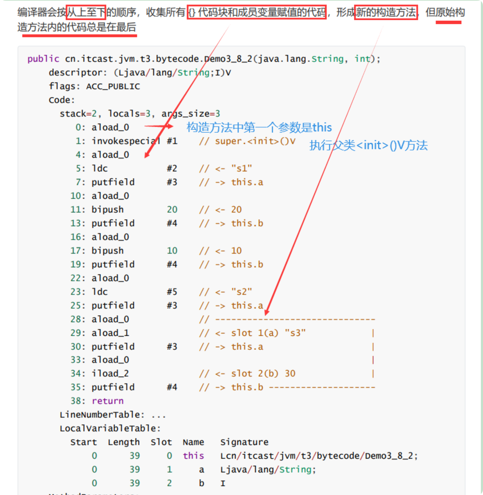

### 1. 字节码源文件组成

- `基本信息`：包括魔数、主副版本、访问标识、父类、接口等；
- `常量池`：字符串常量、类、接口名，用于字节码指令进行符号引用；
- `字段`：当前类声明的字段信息；
- `方法`：当前类声明的方法信息、**方法执行的字节码指令**；
- `属性`：源码文件名、内部类等；

### 2. 字节码指令

[Oracle | JVM 查询文档](https://docs.oracle.com/javase/specs/jvms/se16/html/jvms-6.html)
:::details 加载指令

- iconst\_ (i 代表 int): 将 int 型常量压入操作数栈 (如 iconst_0, iconst_1 等)
- dconst\_ (d 代表 double): 将 double 型常量压入操作数栈
- ldc: 将常量池中的项压入栈 (用于 String 等)
  :::

:::details 局部变量加载/存储指令

- iload: 从局部变量表加载 int 到操作数栈
- istore: 将 int 从操作数栈存储到局部变量表

类似的有 lload, lstore: long 类型操作；fload, fstore: float 类型操作；dload, dstore: double 类型操作；aload, astore: 引用类型操作。
:::

:::details 算术指令

- iadd, isub, imul, idiv, irem: int 加减乘除取余
  :::

:::details 条件判断指令

- ifeq, ifne, iflt, ifge, ifgt, ifle: int 条件判断
  :::

:::details 方法调用指令

- nvokevirtual: 调用实例方法(虚方法分派)
- invokespecial: 调用特殊方法(构造方法、私有方法等)
- invokestatic: 调用静态方法
- invokeinterface: 调用接口方法
- invokedynamic: 动态方法调用
- ireturn, lreturn, freturn, dreturn, areturn: 返回各种类型
- return: 返回 void
  :::

### 3. 语法原理

#### （1）i++ & ++i

:::details i++原理


:::

:::details ++i 原理


:::

对比：
<c-table
  :columns="[
    { title: '表达式', key: 'expression' },
    { title: '执行顺序', key: 'bytecodeOrder' },
    { title: '区别', key: 'keyDifference' }
  ]"
  :data="[
    { 
      expression: 'x = i++', 
      bytecodeOrder: 'iload → iinc → istore', 
      keyDifference: '先取值，再自增' 
    },
    { 
      expression: 'x = ++i', 
      bytecodeOrder: 'iinc → iload → istore', 
      keyDifference: '先自增，再取值' 
    }
  ]"
/>

:::tip - ++操作的字节码指令为`iinc`，直接修改局部变量的值，不影响操作数栈，因此效率比 i = i + 1 高。
:::

#### （2）linit & init

:::details clinit 原理

```java
public class Demo3_8_1 {
    static int i = 10;
    static {
        i = 20;
    }

    static {
        i = 30;
    }
}
```

字节码指令：


:::

:::details init 原理

```java
public class Demo3_8_2 {
    private String a = "s1";

    {
        b = 20;
    }

    private int b = 10;

    {
        a = "s2";
    }

    public Demo3_8_2(String a, int b) {
        this.a = a;
        this.b = b;
    }

    public static void main(String[] args) {
        Demo3_8_2 d = new Demo3_8_2("s3", 30);
        System.out.println(d.a);
        System.out.println(d.b);
    }
}
```

字节码指令：


:::

#### （3）try-catch-finally（见 xmind 笔记）
