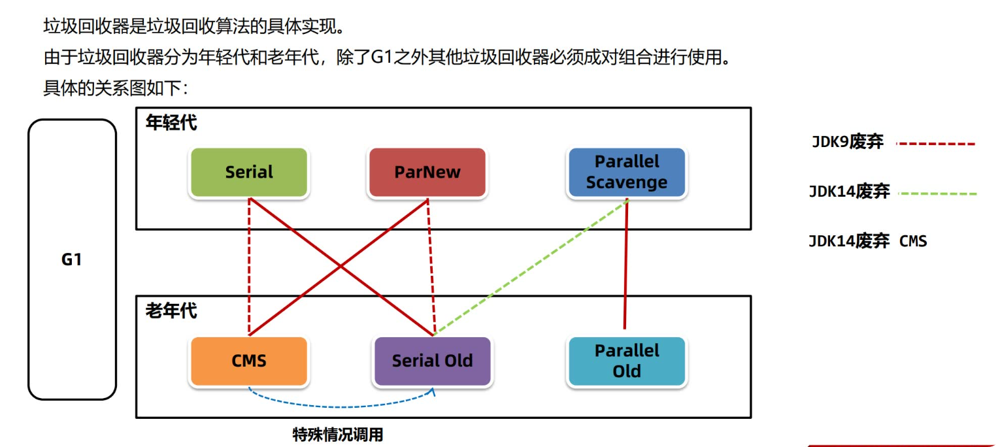
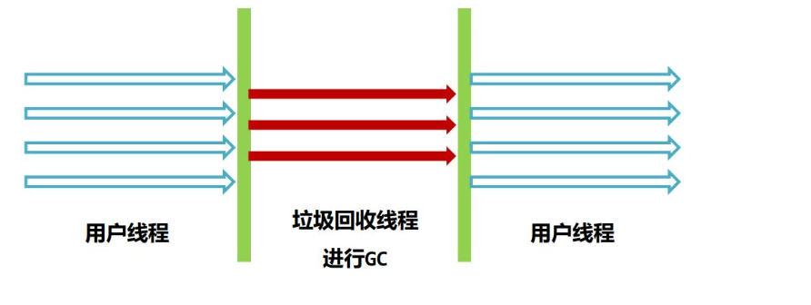
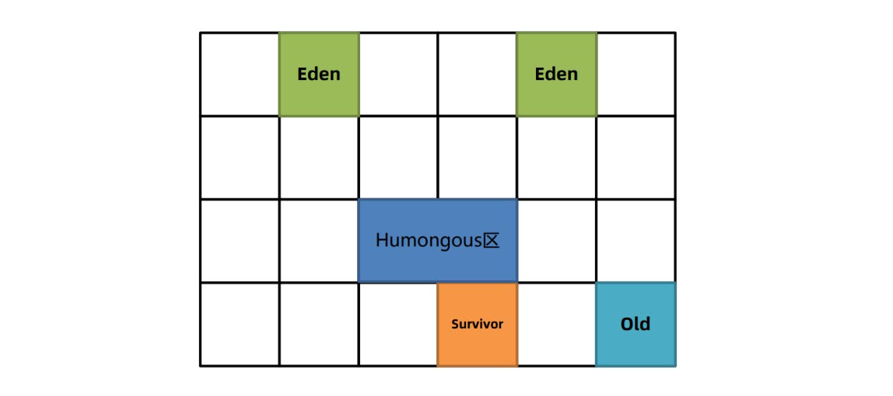

### **1. 简介**

- 针对`线程共享区域`，主要是堆区；System.gc()方法可请求JVM进行GC，但是否GC由JVM决定。
- 对于`线程不共享`的部分，是伴随着线程的创建而创建，线程的销毁而释放；而`栈帧`则是在==执行完方法之后就会立刻弹出栈并释放掉对应的内存（也就是局部变量表、操作数栈、帧数据）==。

:::details GC主要回收不使用的对象，那么引用该对象的变量（指针）如何回收？

分三种情况：
```java
Class A {
  private Object a;
  private static Object b;
  public void method() {
    Object c = new Object();
  }
 }
```
1. 成员变量引用：变量a作为实例对象A的一部分，保存在堆中，当对象A被GC，变量a部分的内存随之释放；
2. 静态变量引用：变量b随着类保存在方法区中，类被卸载时（方法区的回收，触发条件很苛刻），变量b部分内存也随之释放；
3. 局部变量引用：变量c保存在栈帧的局部变量表中，栈帧弹出，也就是方法执行完毕时，变量c部分内存也随之释放。
:::

:::important 不要认为GC机制仅针对大型项目或系统资源匮乏的系统

以Java web项目为例：项目只要在运行，就在不断地处理请求（即使并发量低）。每一个HTTP请求的到来，都可能伴随着创建各种必要对象，如数据库连接、请求参数VO、DTO、POJO，以及临时存储数据的集合、字符串等，这些对象在请求处理结束后，绝大部分都会立刻变成垃圾。GC的任务就是回收这些“短命”的对象。如没有GC机制，这些短命垃圾就会随着不断到来的请求越堆越多。

:::

### **2. 方法区垃圾回收**
方法区中能回收的内容主要就是不再使用的类、常量池中不再使用的常量（通常在full GC时触发）。判定一个类可以被卸载。需要同时满足下面三个条件：
1. `堆中无实例`： 该类在Java堆中不存在任何实例对象。
2. `类加载器不可达`： 加载该类的类加载器对象本身已经不可达，即被标记为可回收。
3. `Class对象无引用`： 该类对应的 java.lang.Class 对象没有被任何地方引用。

简单来说，一个类必须与其所在的“生态”完全断绝关系才能被卸载：它的“孩子”（实例）没了，它的“父母”（类加载器）也没了，并且它自己的“名片”（Class对象）也没人记得了。

:::tip 实际应用

开发中此类场景一般很少出现，主要在如OSGi、JSP的热部署等应用场景中。每个jsp文件对应一个唯一的类加载器，当一个jsp文件修改了，就直接卸载这个jsp类加载器。重新创建类加载器，重新加载jsp文件。

:::

### **3. 堆区垃圾回收**
#### 3.1 垃圾标识算法

(1) 引用计数法  
引用计数法会为每个对象维护一个引用计数器，当对象被引用时加1，取消引用时减1。
- 优点：实现简单；
- 缺点：
    - 每次引用和取消引用都需要维护计数器，对系统性能会有一定的影响；
    - 算法本身无法解决循环引用问题。

(2) 可达性分析算法  
JVM内部会维护所以GC root 对象列表，沿着GC Root对象的引用链找到所有对象都是可达的，而不可达将标记为可回收。

GC Root对象主要包括以下四大类：
- Thread对象；
- 类加载器对象；
- 监视器对象，用来保存同步锁synchronized关键字持有的对象。
- 本地方法调用时使用的全局对象。
:::tip
GC ROOT对象只是算法提出的概念，由JVM厂商实现。对于开发者而言，真正的GC Root对象开发者无法直接访问，但我们可以将以下四大类当作GC Root：
- 局部变量
- 静态变量、常量
- 锁对象
- 本地方法栈中引用的对象
:::
#### 3.2 五种引用
可达性算法中描述的对象引用，一般指的是强引用，即是GCRoot对象对普通对象有引用关系，只要这层关系存在，普通对象就不会被回收。除了强引用之外，Java中还设计了几种其他引用方式：
:::details 软引用
由`java.lang.ref.SoftReference`类实现，当一个对象只有软引用指向它时，==只有当JVM内存不足时==才会回收该对象。软引用可以用来设计一些缓存，当内存空间不足时，缓存中的对象就可以被回收，腾出内存空间。
:::
:::details 弱引用
由`java.lang.ref.WeakReference`类来实现，当一个对象只有弱引用指向它时，==在垃圾回收时==就该对象就会被回收。弱引用常用于实现对内存敏感的高速缓存。（与软引用的区别是内存充足时也会被GC）
:::
:::details 虚引用
虚引用也叫幽灵引用幻影引用，不能通过虚引用对象获取到包含的对象。虚引用唯一的用途是当对象被垃圾回收器回收时可以接收到对应的通知。
Java中使用`PhantomReference`实现了虚引用，直接内存中为了及时知道直接内存对象不再使用，从而回收内存，使用了虚引用来实现。
:::
:::details 终结器引用
终结器引用指的是在对象需要被回收时，终结器引用会关联对象并放置在Finalizer类中的引用队列中，在稍后由一条由FinalizerThread线程从队列中获取对象，然后执行对象的finalize方法，在对象第二次被回收时，该对象才真正的被回收。在这个过程中可以在finalize方法中再将自身对象使用强引用关联上，但是不建议这样做。
:::

:::important 引用队列
数据结构为队列，由Reference Handler线程定时执行。在使用软、弱、虚引用时的作用如下：
- ==回收引用包装对象（如SoftReference对象）==：当软引用或弱引用对象被GC时，软引用或弱引用包装对象就会加入队列，可以调用API获取队列中的软引用或弱引用包装对象，并进行释放内存操作（将软弱引用包装对象置为null或在列表中移除）
- ==执行虚引用对象的指定方法==：当被虚引用的对象被GC时，虚引用对象本身会加入队列，然后引用队列会由Reference Handler线程定时地调用虚引用对象本身的指定方法（在ByteBuffer中指定了调用clean方法，释放掉直接内存）

:::
#### 3.3 垃圾回收算法

判断GC算法是否优秀，可以从三个方面来考虑：

:::details 吞吐量

- 吞吐量指的是CPU用于执行用户代码的时间与CPU总执行时间的比值，即吞吐量 = 执行用户代码时间 /（执行用户代码时间+ GC时间）。吞吐量数值越高，垃圾回收的效率就越高。

<div class="flex-container">
    <h4 style="flex: 3">执行用户代码</h4>
    <h4 style="flex: 1">GC STW</h4>
    <h4 style="flex: 3">执行用户代码</h4>
    <h4 style="flex: 1">GC STW</h4>
    <h4 style="flex: 3">执行用户代码</h4>
</div>

比如：虚拟机总共运行了100分钟，其中GC花掉1分钟，那么吞吐量就是99%

:::

:::details 最大暂停时间
- `STW时间`：垃圾回收过程会通过单独的GC线程来完成，但是不管使用哪一种GC算法，都会有部分阶段需要停止所有的用户线程。这个过程被称之为Stop The World, 简称STW，如果STW时间过长则会影响用户的使用。

- `最大暂停时间`指的是所有在垃圾回收过程中的==STW时间最大值==。比如如下的图中，黄色部分的STW就是最大暂停时间，显而易见上面的图比下面的图拥有更少的最大暂停时间。最大暂停时间越短，用户使用系统时受到的影响就越短。

<div class="flex-container">
    <h4 style="flex: 3">执行用户代码</h4>
    <h4 style="flex: 1; background: yellow">GC STW</h4>
    <h4 style="flex: 3">执行用户代码</h4>
    <h4 style="flex: 1">GC</h4>
    <h4 style="flex: 3">执行用户代码</h4>
</div>

<div class="flex-container">
    <h4 style="flex: 5">执行用户代码</h4>
    <h4 style="flex: 3; background: yellow">GC STW</h4>
    <h4 style="flex: 5">执行用户代码</h4>
    <h4 style="flex: 1">GC</h4>
    <h4 style="flex: 5">执行用户代码</h4>
</div>

:::

:::details 堆使用效率

不同垃圾回收算法，对堆内存的使用方式是不同的。比如标记清除算法，可以使用完整的堆内存，但会产生内存碎片，若不经过整理无法存放较大的新对象。而复制算法会将堆内存一分为二，每次只能使用一半内存，但不会产生内存碎片。从堆使用效率上来说，标记清除算法要优于复制算法。

:::

:::tip 上述三种评价标准不可兼得。
:::

##### 3.3.1 标记清除算法

标记清除算法的核心思想分为两个阶段：
1. 标记阶段：利用可达性分析算法标记所有存活对象；
2. 清除阶段：从内存中删除没有被标记也就是非存活对象。

`优点`：实现简单，只需要在第一阶段给每个对象维护标志位，第二阶段删除对象即可。

`缺点`：

- ==碎片化问题==。由于内存是连续的，所以在对象被删除之后，内存中会出现很多细小的可用内存单元。如果我们需要的是一个比较大的空间，很有可能这些内存单元的大小过小无法进行分配。
- ==分配速度慢==。由于内存碎片的存在，需要维护一个空闲链表，极有可能发生每次需要遍历到链表的最后才能获得合适的内存空间。

##### 3.3.2 复制算法

复制算法的核心思想是：
1. 准备两块空间From空间和To空间，每次在对象分配阶段，只能使用其中一块空间（From空间）。
2. 在垃圾回收GC阶段，将From中存活对象复制到To空间。
3. 将两块空间的From和To名字互换。`

`优点`：
- ==吞吐量高==。复制算法只需要遍历一次存活对象复制到To空间即可，比标记-整理算法少了一次遍历的过程，因而性能较好，但是不如标记-清除算法，因为标记清除算法不需要进行对象的移动。
- ==不会发生碎片化==。复制算法在复制之后就会将对象按顺序放入To空间中，所以对象以外的区域都是可用空间，不存在碎片化内存空间。

`缺点`：==内存使用效率低==。每次只能让一半的内存空间来为创建对象使用。

##### 3.3.3 标记整理算法

标记整理算法也叫标记压缩算法，是对标记清理算法中容易产生内存碎片问题的一种解决方案。核心思想分为两个阶段：

1. 标记阶段：利用可达性分析算法标记所有存活对象；
2. 整理阶段：将存活对象移动到堆的一端。清理掉存活对象的内存空间。


`优点`：
- ==内存使用效率高==。整个堆内存都可以使用，不会像复制算法只能使用半个堆内存。
- ==不会发生碎片化==。在整理阶段可以将对象往内存的一侧进行移动，剩下的空间都是可以分配对象的有效空间。

`缺点`：==整理阶段的效率不高==。整理算法有很多种，比如Lisp2整理算法需要对整个堆中的对象搜索3次，整体性能不佳。可以通过Two-Finger、表格算法、ImmixGC等高效的整理算法优化此阶段的性能。

#### 3.4 分代垃圾回收模型（机制）

现代优秀的垃圾回收算法，会将上述描述的垃圾回收算法组合进行使用，其中应用最广（主流JVM厂商）的就是分代垃圾回收模型。

##### 3.4.1 内存划分

分代垃圾回收将整个内存区域划分为年轻代和老年代：


##### 3.4.2 分代垃圾流程

:::warning 注：以下为大致流程，具体流程实现需要依据具体的垃圾回收器。
:::

分代回收时，创建出来的对象，首先会被放入Eden伊甸园区。随着对象在Eden区越来越多，如果Eden区满，新创建的对象已经无法放入，就会触发年轻代的GC，称为`Minor GC`或者`Young GC`。Minor GC会把需要eden中和From需要回收的对象回收，把没有回收的对象放入To区。


接下来，S0会变成To区，S1变成From区。当eden区满时再往里放入对象，依然会发生Minor GC。此时会回收eden区和S1(from)中的对象，并把eden和from区中剩余的对象放入S0。==每次Minor GC中都会为对象记录他的年龄，初始值为0，每次GC完加1==。


如果Minor GC后对象的年龄达到阈值（最大15，默认值和垃圾回收器有关），对象就会被晋升至老年代。当老年代中空间不足，无法放入新的对象时，先尝试minor gc如果还是不足，就会触发Full GC，Full GC会对==整个堆==进行垃圾回收。如果Full GC依然无法回收掉老年代的对象，那么当对象继续放入老年代时，就会抛出Out Of Memory异常。


:::tip 实际上触发垃圾回收的动作不仅限于Minor GC或Full GC：
- `Mixed GC`：在G1垃圾收集器中发生，同时回收年轻代区域和部分老年代区域时。
- `Old GC (或Major GC)`： 某些收集器（如CMS、G1）执行专门针对==老年代的回收==，无需扫描整个堆。例如，CMS通过Concurrent Mark-Sweep周期独立处理老年代。
:::

##### 3.4.3 JVM参数
--

#### 3.5 垃圾回收器


##### 3.5.1 Serial串行组合

:::details Serial

Serial是是一种单线程串行回收年轻代的垃圾回收器，使用`复制算法`。

- 优点：单CPU处理器下吞吐量非常出色。
- 缺点：多CPU下吞吐量不如其他垃圾回收器，堆如果偏大会让用户线程处于长时间的等待。
- 适用场景：==Java编写的客户端程序或者硬件配置有限的场景==。

:::

:::details Serial Old

SerialOld是Serial垃圾回收器的老年代版本，采用单线程串行回收，算法为`标记-整理`算法。

- 优点缺点和Serial一样。
- 适用场景：==与Serial垃圾回收器搭配使用，或者在CMS特殊情况下使用==。

:::

`-XX:+UseSerialGC`：新生代、老年代都使用串行回收器。

##### 3.5.2 ParNew + CMS 组合

:::details ParNew

本质上是对Serial在多CPU下的优化，使用多线程、`复制算法`对年轻代进行垃圾回收。

- 优点：多CPU处理器下停顿时间较短。
- 缺点：吞吐量和停顿时间不如G1，所以在JDK9之后不建议使用。
- 适用场景：==JDK8及之前的版本中，与CMS老年代垃圾回收器搭配使用==。

:::

:::details CMS
CMS垃圾回收器关注的是STW，允许用户线程和垃圾回收线程在某些步骤中同时执行，减少了用户线程的等待时间。

- 回收年代与算法：老年代、`标记清除`。
- 回收流程: 
  1. 初始标记，用极短的时间标记出GCRoots能直接关联到的对象;
  2. 并发标记，标记所有的对象，用户线程不需要暂停;
  3. 重新标记，由于并发标记阶段有些对象会发生了变化，存在错标、漏标等情况，需要重新标记;
  4. 并发清理，清理死亡的对象，用户线程不需要暂停。

  

- 优点：系统由于垃圾回收出现的停顿时间较短，用户体验好。
- 缺点：
  1. CMS使用了标记-清除算法，在垃圾收集结束之后会出现大量的==内存碎片==。默认情况下CMS会在`Full GC`时进行碎片的整理，但会导致用户线程暂停，可以使用`-XX:CMSFullGCsBeforeCompaction`调整这一行为（见下文JVM参数）。
  2. 无法处理在并发清理过程中产生的==浮动垃圾==，不能做到完全的垃圾回收。
  3. 如果老年代内存不足无法分配对象，CMS就会==退化==成Serial Old单线程回收老年代。
  4. 线程资源争抢问题；由于CPU的核心数有限，就会影响用户线程执行的性能。

- 适用场景：==大型的互联网系统中用户请求数据量大、频率高的场景比如订单接口、商品接口等==。

:::

相关JVM参数：

- `-XX:+UseParNewGC -XX:+UseConcMarkSweepGC` ：新生代使用ParNew回收器，老年代使用CMS回收器。
- `-XX:CMSFullGCsBeforeCompaction=N`：
  - 默认为0，表示CMS只会在**Full GC**才会整理内存碎片；
  - 设置为N，表示 N + 1 个 **CMS回收周期** [+CMS回收周期] 时，尽管不触发Full GC也会整理内存碎片。
- `-XX:ConcGCThreads`：CMS中并发阶段运行时的线程数。默认值由JVM根据系统配置计算得出。在Windows系统中可通过`java -XX:+PrintFlagsFinal -version | find "ConcGCThreads"`命令查看

[+CMS回收周期]: 包括并发标记、并发清理阶段；不包括初始标记、重新标记阶段。

##### 3.5.3 Parallel Scavenge + Parallel Old 组合

Java8中的默认组合，关注系统的吞吐量。


:::details Parallel Scavenge

Parallel Scavenge是JDK8默认的年轻代垃圾回收器，多线程并行回收，关注的是系统的吞吐量。具备自动调整堆内存大小的特点。

- 回收年代与算法：年轻代、`复制算法`。
- 优点：吞吐量高，而且手动可控。为了提高吞吐量，虚拟机会动态调整堆的参数。
- 缺点：不能保证单次的停顿时间。
- 适用场景：==后台任务，不需要与用户交互，并且容易产生大量的对象比如：大数据的处理，大文件导出==。

:::

:::details Parallel Old

Parallel Old是为Parallel Scavenge收集器设计的老年代版本，利用多线程并发收集。

- 回收年代与算法：老年代、`标记整理算法`。
- 优点：并发收集，在多核CPU下效率较高。
- 缺点：暂停时间会比较长。
- 适用场景：==与Parallel Scavenge配套使用==。

:::

相关JVM参数：

Parallel Scavenge允许手动设置最大暂停时间和吞吐量。Oracle官方建议在使用这个组合时，==不要设置堆内存的最大值=={.important}，垃圾回收器会根据最大暂停时间和吞吐量自动调整内存大小。

- `-XX:+UseAdaptiveSizePolicy`：==自动调整内存大小==。设置可以让垃圾回收器根据吞吐量和最大停顿的毫秒数自动调整内存大小。
- `-XX:+ParallelGCThreads=N`：==设置并发线程数==。设置并发线程数。
- `-XX:MaxGCPauseMillis=N`：==设置STW==。设置每次垃圾回收时的最大停顿毫秒数。
- `-XX:GCTimeRatio=ratio`：==设置吞吐量==。定义 `JVM运行时间 : GC时间 = ratio : 1`。默认为99，即GC时间占JVM运行时间的1%。例如JVM运行时间是100分钟，那么总的GC时间为1分钟。

:::info `-XX:MaxGCPauseMillis`和`-XX:GCTimeRatio`设置的是一个期望值，JVM会一般会通过动态调整堆大小，以达到此期望值，因此如果你设置了固定堆大小参数，这两个的参数将无效。
:::

##### 3.5.4 G1

Java 9+ 默认的垃圾回收器，兼顾吞吐量和STW。

:::info G1垃圾回收器的特点如下

1. 支持巨大的堆空间回收，并有较高的吞吐量。
2. 支持多CPU并行垃圾回收。
3. 根据既定目标（默认是STW为200ms）决定垃圾回收的程度，以尽量满足此目标。

:::

:::details G1 回收流程

G1将堆内存划分为多个大小固定的 Region。在逻辑上，这些Region被归为四类，同一类在内存中不要求是连续的：

1. Eden Regions：存放新创建的对象。
2. Survivor Regions：存放年轻代GC后存活下来的对象。
3. Old Regions：存放经历了多次年轻代GC后仍然存活的对象（晋升的老年代对象）。
4. Humongous Regions：专门存放巨型对象（大小超过单个Region容量50%的对象）。

==G1的回收就是在这些Region之间拷贝对象==。


G1垃圾回收器主要分为`Young GC` 与 `并发回收周期`：
1. Young GC：
  - 回收算法：复制算法。
  - 触发条件：Eden区满，无法分配对象时触发；
  - 回收区域：新生代（Eden Regions + Survivor Regions）；

2. 并发回收周期：
  - 回收算法：复制算法;
  - 触发条件：老年代占用率达到IHOP阈值（默认45%）；
  - 回收区域：新生代 + 部分选中的老年代Region；
  - 回收策略：优先回收存活率低的Region（G1名字的来由）；
  - 工作流程：初始标记（STW）-> 根区域扫描（并发）-> 并发标记 -> 最终标记（STW）-> 筛选回收（STW）；`Mixed GC` 发生在筛选回收阶段，负责执行实际的回收。；
  - 退化条件：当垃圾回收速度跟不上对象分配速度，导致在复制存活对象时找不到足够的空闲Region，G1会触发一次 `Full GC`，应极力避免。（Full GC在Java 9之前是单线程的Serial Old GC，Java 10+是并行标记整理，但仍然是STW且性能很差）

:::

JVM参数：

- `-XX:+UseG1GC`：打开G1的开关，JDK9之后为默认垃圾回收器，不需要手动打开;
- `-XX:InitiatingHeapOccupancyPercent`：并发回收周期的触发阈值，默认45%；
- `-XX:G1HeapRegionSize=Xm` : 指定region大小为 X m。默认情况下，JVM尽量将堆内存划分为大约 2048个 左右的Region，但Region的大小必须是2的指数幂（此限制同样适用于此参数），取值范围从1M到32M。

##### 3.5.5 总结

| GC组合 | 启用参数 | 设计目标 | 
|--------|----------|----------|
| Parallel Scavenge + Parallel Old | `-XX:+UseParallelGC` | 吞吐量优先 |
| ParNew + CMS | `-XX:+UseParNewGC` `-XX:+UseConcMarkSweepGC` | 低延迟优先 |
| Serial + Serial Old | `-XX:+UseSerialGC` | 单CPU/客户端模式 |
| G1 | `-XX:+UseG1GC` | 平衡型，可预测停顿 |

<style scoped>
.flex-container {
  height: 70px;
  margin: 30px;
  display: flex;
  align-items: stretch;
  border: 1px solid #000;
  h4 {
    height: 100%;
    margin: 0;
    padding: 0 10px;
    display: flex;
    justify-content: center;
    align-items: center;
    border: 1px solid #000;
  }
}
</style>