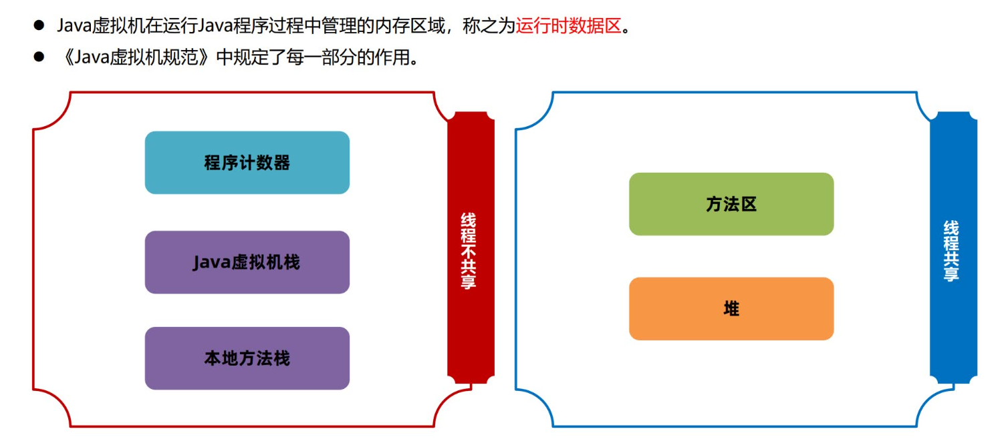
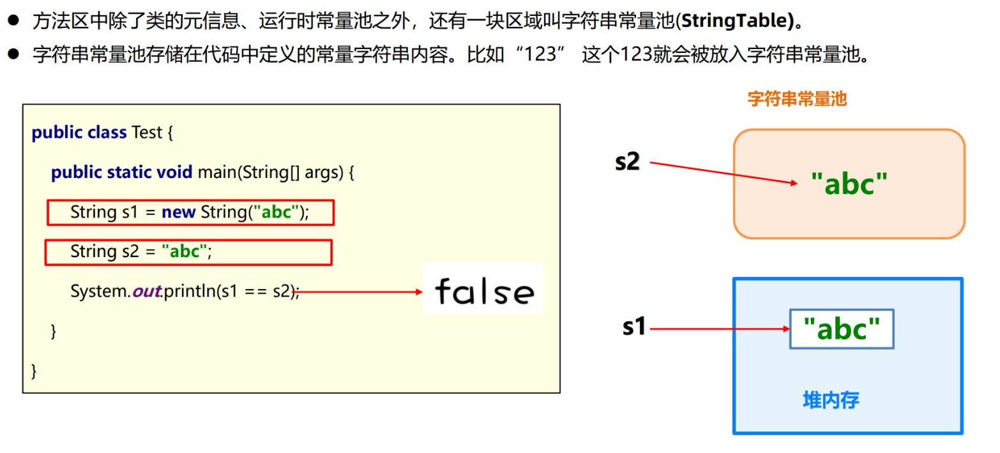

### 1. 总览



### 2. 程序计数器

- 在加载阶段，JVM将字节码文件中的指令读取到内存之后，会将原文件中的偏移量转换成内存地址。==每一条字节码指令都会拥有一个内存地址。==
- 在代码执行过程中，==程序计数器会记录下一行字节码指令的地址==：
    - `顺序执行`：执行引擎会从程序计数器中取出当前指令的地址，执行该指令，然后自动将程序计数器的值设为该指令的后一条指令；
    - `条件控制，循环等`：当遇到控制流指令（如条件分支、循环、return、goto）时，执行引擎会修改PC寄存器的值，而不是简单地让其自增，这实现了程序的非线性执行。
- 在多线程执行情况下，JVM需要通过程序计数器==记录CPU切换前解释执行到那一句指令==并继续解释运行。

### 3. 栈

#### (1) 简介

Java虚拟机栈随着线程的创建而创建，而回收则会在线程的销毁时进行，因此虚拟机栈是==线程私有==的。


#### (2) 栈帧
栈帧是虚拟机栈的栈元素，用于支持JVM进行方法调用和方法执行的数据结构，由以下结构构成：
 
:::details 局部变量表
作用是在方法执行过程中存放所有的局部变量、对象实例（仅实例方法）， 编译成字节码文件时就可以确定局部变量。
:::

:::details 操作数栈
- 操作数栈是栈帧中虚拟机在执行指令过程中用来存放中间数据的一块区域。他是一种栈式的数据结构，如果一条指令将一个值压入操作数栈，则后面的指令可以弹出并使用该值。
- 在编译期就可以确定操作数栈的最大深度，从而在执行时正确的分配内存大小。
:::

:::details 帧数据
包含动态链接、方法出口、异常表的引用。
- `动态链接`：当前类的字节码指令引用了其他类的属性或者方法时，需要将符号引用（编号）转换成对应的运行时常量池中的内存地址。动态链接就保存了编号到运行时常量池的内存地址的映射关系。量表的内容。
- `方法出口`：方法出口指的是方法在正确或者异常结束时，当前栈帧会被弹出，同时程序计数器应该指向上一个栈帧中的下一条指令的地址。所以在当前栈帧中，需要存储此方法出口的地址。
- `异常表`：异常表存放的是代码中异常的处理信息，包含了异常捕获的生效范围以及异常发生后跳转到的字节码指令位置。
:::

#### (3) 内存溢出

当不断往栈加入栈帧导致栈空间不足时，JVM会抛出StackOverflowError异常。如`无限递归`。

#### (4) JVM参数
- 语法：-Xss栈大小
- 单位：无（即为字节）、k、m、g（单位不区分大小写，为字节时默认必须是1024的倍数）
- 示例：
```bash
-Xss104857
-Xss1024K
-Xss1m
-Xss1g
```

#### (5) JVM调优
以下情况可考虑调优：
- ==系统活跃线程数多==，如1000个活跃线程占创建1000个栈，若栈大小为1M，则需要1G内存；
- ==递归调用层数较少、方法调用链不多、局部变量不多==的情况，可适当条低虚拟机栈内存；
- 建议先设置为256k试试。


:::warning 调整栈内存大小需要经过多轮测试，确保生产环境不易出现StackOverflowError
:::

#### (5) 本地方法栈
与 java虚拟机栈对应，用于调用方法时存放本地方法栈帧。

### 4. 堆

#### (1) 简介


#### (2) 按容量划分

<div style="display: flex; width: 100%; justify-content: center">
  <div style="display: flex; width: 500px; height: 100px; border: 1px solid black;">
    <div style="height: 100%; flex: 3; background-color: #DBEEF4; display: flex; justify-content: flex-end; align-items: flex-end;">used</div>
    <div style="height: 100%; flex: 2; background-color: #D6E5BE; display: flex; justify-content: flex-end; align-items: flex-end;">total</div>
    <div style="height: 100%; flex: 1; background-color: #FDEADA; display: flex; justify-content: flex-end; align-items: flex-end;">max</div>
  </div>
</div>


- `used` 指的是当前已使用的堆内存;
- `total`是java虚拟机已经分配的可用堆内存;
- `max` 是java虚拟机可以分配的最大堆内存。

:::tip 这里只是从堆容量的角度划分，按内存管理模式划分则为分为新生代和老生代，具体查阅垃圾回收章节。
:::

#### (3) 内存溢出

当创建的对象过多时，会造成内存溢出的错误，报：`java.lang.OutOfMemoryError: Java heap space`。

#### (4) JVM参数
- 语法：
    - -Xmx 最大堆内存`max`
    - -Xms 初始堆内存，即JVM启动时分配的堆内存`total`
值
- 单位：无（即为字节）、k、m、g（单位不区分大小写，为字节时默认必须是1024的倍数）
- 示例：
```bash
-Xms6291456
-Xms6144k
-Xms6m
-Xmx83886080
-Xmx81920k
-Xmx80m
```
#### (5) JVM调优

Java服务端程序开发时，建议将-Xmx和-Xms设置为相同的值，这样在程序启动之后可使用的总内存就是最大内存，而无需向java虚拟机再次申请，减少了申请并分配内存时间上的开销，同时也不会出现内存过剩之后堆收缩的情况。

以下是`默认行为`与`将-Xmx和-Xms设置为相同的值`对比：
<c-table 
  :columns="[
    { title: '参数', key: 'params', width: '90px' },
    { title: 'JVM行为', key: 'behavior' },
    { title: '优点', key: 'advantages' },
    { title: '缺点', key: 'disadvantages' },
    { title: '适用场景', key: 'applicableScenes', width: '150px' }
  ]" 
  :data="[
    { 
      params: '-Xmx4g', 
      behavior: '堆内存从一个初始值开始，随着堆中对象的增多逐步扩张Total，直到达到Max。', 
      advantages: '节省内存', 
      disadvantages: '堆扩容操作会带来性能开销，如gc等', 
      applicableScenes: '开发环境、对启动内存敏感的环境。' 
    },
    { 
      params: '-Xms4g -Xmx4g', 
      behavior: 'JVM在启动时就直接申请到最大堆内存，Total从一开始就等于Max。', 
      advantages: '避免运行时堆扩容带来的性能损耗', 
      disadvantages: '启动时占用大量内存，可能影响当前机器上的其他进程。', 
      applicableScenes: '绝大多数生产环境' 
    },
  ]" 
/>

### 5. 方法区

#### (1) 简介
方法区是用来存储每个类的基本信息（元信息），一般称之为`InstanceKlass`对象。在类的加载阶段完成，主要存放以下三部分内容：
- 类的元信息：保存了所有类的基本信息;
:::details 运行时常量池

:::

:::details 字符串常量池

:::

:::tip 方法区是《Java虚拟机规范》中设计的虚拟概念，每款Java虚拟机在实现上都各不相同
Hotspot设计如下：
- JDK7及之前的版本将方法区存放在堆区域中的永久代空间，堆的大小由虚拟机参数来控制。
- JDK8及之后的版本将方法区存放在元空间中，元空间位于操作系统维护的直接内存中，默认情况下只要不超过操作系统承受的上限，可以一直分配。

:::

#### (2) 方法区内存溢出 & JVM参数
实验发现，JDK7上运行大概十几万次，就出现了错误。在JDK8上运行百万次，程序都没有出现任何错误，但是内存会直线升高。这说明JDK7和JDK8在方法区的存放上，采用了不同的设计：
- JDK7将方法区存放在堆区域中的永久代空间，堆的大小由虚拟机参数 `-XX:MaxPermSize=值` 来控制。
- JDK8将方法区存放在元空间中，元空间位于操作系统维护的直接内存中，默认情况下只要不超过操作系统承受的上限，可以一直分配。可以使用 `-XX:MaxMetaspaceSize=值` 将元空间最大大小进行限制。

### 6. 直接内存
独立于JVM堆内存，使用操作系统的内存，多用于NIO、网络编程中。
- 分配直接内存的语法：`ByteBufferdirectBuffer= ByteBuffer.allocateDirect(size)`
- 虚拟机参数：`-XX:MaxDirectMemorySize=大小`；默认值等于 -Xmx (最大堆内存) 的值
- 直接内存的分配不受Java堆大小的限制，但受 -XX:MaxDirectMemorySize 的限制;
- 如果直接内存使用超过 -XX:MaxDirectMemorySize 的限制，会抛出 `java.lang.OutOfMemoryError: Direct buffer memory`
