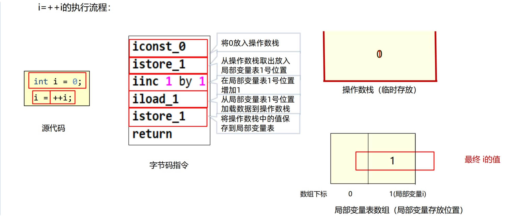
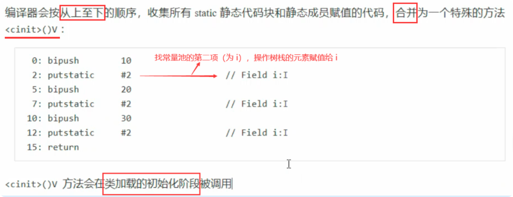

# JVM

## 1. 简介

### 1.1 java 代码运行流程


### 1.2 JVM 组成


### 1.3 JVM 功能

- 解释和运行：实时解释字节码指令为机器码，让计算机执行；
- 内存管理：为对象、方法分配内存、垃圾回收等；
- 即时编译：对热点代码进行优化，提升执行效率。
  

## 2. 字节码技术

### 2.1 字节码源文件组成

- `基本信息`：包括魔数、主副版本、访问标识、父类、接口等；
- `常量池`：字符串常量、类、接口名，用于字节码指令进行符号引用；
- `字段`：当前类声明的字段信息；
- `方法`：当前类声明的方法信息、**方法执行的字节码指令**；
- `属性`：源码文件名、内部类等；

### 2.2 字节码指令

[Oracle | JVM 查询文档](https://docs.oracle.com/javase/specs/jvms/se16/html/jvms-6.html)
:::details 加载指令

- iconst\_ (i 代表 int): 将 int 型常量压入操作数栈 (如 iconst_0, iconst_1 等)
- dconst\_ (d 代表 double): 将 double 型常量压入操作数栈
- ldc: 将常量池中的项压入栈 (用于 String 等)
  :::

:::details 局部变量加载/存储指令

- iload: 从局部变量表加载 int 到操作数栈
- istore: 将 int 从操作数栈存储到局部变量表

类似的有 lload, lstore: long 类型操作；fload, fstore: float 类型操作；dload, dstore: double 类型操作；aload, astore: 引用类型操作。
:::

:::details 算术指令

- iadd, isub, imul, idiv, irem: int 加减乘除取余
  :::

:::details 条件判断指令

- ifeq, ifne, iflt, ifge, ifgt, ifle: int 条件判断
  :::

:::details 方法调用指令

- nvokevirtual: 调用实例方法(虚方法分派)
- invokespecial: 调用特殊方法(构造方法、私有方法等)
- invokestatic: 调用静态方法
- invokeinterface: 调用接口方法
- invokedynamic: 动态方法调用
- ireturn, lreturn, freturn, dreturn, areturn: 返回各种类型
- return: 返回 void
  :::

### 2.3 语法原理

#### （1）i++ & ++i

:::details i++原理


:::

:::details ++i 原理



:::

对比：
<c-table
  :columns="[
    { title: '表达式', key: 'expression' },
    { title: '执行顺序', key: 'bytecodeOrder' },
    { title: '区别', key: 'keyDifference' }
  ]"
  :data="[
    { 
      expression: 'x = i++', 
      bytecodeOrder: 'iload → iinc → istore', 
      keyDifference: '先取值，再自增' 
    },
    { 
      expression: 'x = ++i', 
      bytecodeOrder: 'iinc → iload → istore', 
      keyDifference: '先自增，再取值' 
    }
  ]"
/>

:::tip - ++操作的字节码指令为`iinc`，直接修改局部变量的值，不影响操作数栈，因此效率比 i = i + 1 高。
:::

#### （2）linit & init

:::details clinit 原理

```java
public class Demo3_8_1 {
    static int i = 10;
    static {
        i = 20;
    }

    static {
        i = 30;
    }
}
```

字节码指令：


:::

:::details init 原理

```java
public class Demo3_8_2 {
    private String a = "s1";

    {
        b = 20;
    }

    private int b = 10;

    {
        a = "s2";
    }

    public Demo3_8_2(String a, int b) {
        this.a = a;
        this.b = b;
    }

    public static void main(String[] args) {
        Demo3_8_2 d = new Demo3_8_2("s3", 30);
        System.out.println(d.a);
        System.out.println(d.b);
    }
}
```

字节码指令：


:::

#### （3）try-catch-finally（见 xmind 笔记）

## 3. 类加载器

### 3.1 类的生命周期

类的生命周期描述了一个类加载、使用、卸载的整个过程：


#### (1) 加载

类加载器将字节码信息（.class 文件、动态代理生成或网络传输的字节码）加载到方法区中；

- 创建 `InstanceKlass` 对象，保存类的所有信息（基本信息、常量池等）；
- 同时在堆中生成一份与方法区中数据类似的`java.lang.Class`对象。

:::details 图示


:::

#### (2) 链接

- 验证：检查字节码是否符合虚拟机规范；
- 准备：为静态变量分配内存并设置默认值（`final修饰的常量` 变量则直接赋值）；
- 解析：将常量池中的符号引用转为直接引用(内存地址)。

#### (3) 初始化

行静态代码块中的代码，并为静态变量赋值。（即执行`clinit`方法）

:::details 以下情况类没有 clinit 方法

- 无静态代码块且无静态变量赋值语句;
- 有静态变量的声明，但是`没有赋值语句`;
- 静态变量时 `final 修饰的常量`，这类变量会在准备阶段直接进行初始化。

:::

:::details 触发类加载的情况

1. 执行 Main 方法的当前类；
2. 首次访问静态变量或静态方法；
3. Class.forName("类名")；
4. new 当前类创建对象；
5. 子类初始化时，若父类还未初始化则先触发（但通过子类访问父类的静态变量只会触发父类初始化）；

:::

:::details 不会触发类加载的情况

1. 访问 final 常量；
2. 创建该类数组；
3. Class.forName("类名", false, ...) 第二个参数为 false。

:::

### 3.2 类加载器

类加载器（ClassLoader）用于获取字节码并将其加载到内存中。

#### 3.2.1 **类加载器分类**
(1). ==启动类加载器（BootstrapClassLoader）==：用于加载 JDK 自带的核心类库。

:::details JDK8 以及 JDK9 之后的启动类加载器

在 JDK8 中：

- 加载 `JAVA_HOME/jre/lib` 目录下的类库文件，此目录下包括 rt.jar，tools.jar，resources.jar 等，其中 java.lang、java.util、java.io 等核心包就位于 rt.jar 中；
- 由虚拟机自身实现（一般是 C++），无法获取其引用。（`String.class.getClassLoader() 返回 null `）；

在 JDK9 及之后：

- 引入 模块化系统 ，移除 `JAVA_HOME/jre` 目录，核心类库存放到 `jmod后缀` 的文件中；
- 部分逻辑由Java代码实现，但同样无法获取其引用。

:::

*[模块化系统]: 模块化系统不在本章的讨论范围。

(2). ==扩展类加载器 (ExtClassLoader)==：用于加载非核心的扩展类库（插件）。

:::details JDK8 以及 JDK9 之后的扩展类加载器

在 JDK8 中：

- 加载 `JAVA_HOME/jre/lib/ext` 目录下的类库文件;
- 继承链：


在 JDK9 及之后：

- 引入 模块化系统 ，`ExtClassLoader` 被重命名为 `PlatformClassLoader`，其职责不再去加载特定目录，而是会去加载一些特定模块（java.xml等）。

:::

(3). ==系统类加载器 (AppClassLoader)==：用于加载`classpath`中的相关类库。

::: details classpath最终确定算法

- 若通过指定了`-cp`或`-classpath`vm参数，则优先使用指定的参数（可指定多个路径）；
- 若没有指定vm参数，则使用`CLASSPATH`环境变量（一般不推荐设置）。
- 若没有`ClASSPATH`环境变量，则使用当前目录（.）。

示例：

```text
/home/user/
|—— myapp/
│   └── MyApp.class
└── lib/
    └── utils.class
```

其中MyApp类中使用到utils中的工具类，且没有设置package包名，系统没有ClASSPATH环境变量；此时进入 `/home/user/myapp` 运行此类:
- 未指定vm参数，报错：ClassNotFoundException，找不到Utils中的类；
- 指定vm参数 `-cp "../lib"`, 报错：ClassNotFoundException，MyApp找不到；
- 添加vm参数 `-cp "../lib/;."`（lib目录和当前目录） 或 `-cp "../"`（user目录）, 运行成功。

:::


:::tip JDK9+中可以使用`--module-path`参数指定模块路径来加载指定模块中的类。
:::

#### 3.2.2 **获取当前类加载器的方式**
```java
public class MyApp {
    public static void main(String[] args) {
        // 方式一：
        ClassLoader cl1 = MyApp.class.getClassLoader();
        // 方式二：
        ClassLoader cl2 = this.getClass().getClassLoader();
        // 方式三：
        ClassLoader cl3 = Thread.currentThread().getContextClassLoader();
    }
 }
```

#### 3.2.3 **使用指定类加载器加载指定类库**

:::details JDK8中通过文件路径的方式

- BootstrapClassLoader:
    - 使用 JVM 参数进行扩展: `-Xbootclasspath/a:jar包目录/jar包名`
    - 放入 jre/lib 下进行扩展 [+extUserClass]

- ExtClassLoader:
    - 使用 JVM 参数进行扩展: `-Djava.ext.dirs=jar包目录`  [+jvmExtUserClass]
    - 放入 /jre/lib/ext 下进行扩展; [+extUserClass2]

- AppClassLoader:
    - vm参数: `-cp` 或 `-classpath` （优先级最高）；
    - `CLASSPATH` （优先级次之）；
    - `.` 默认当前运行目录。
:::

[+extUserClass]: 不推荐，尽可能不要去更改 JDK 安装目录中的内容，会出现即使放进去由于文件名不匹配的问题也不会正常地被加载。
[+extUserClass2]: 不推荐，尽可能不要去更改JDK安装目录中的内容。
[+jvmExtUserClass]: 推荐，使用进行扩展,这种方式会覆盖掉原始目录，可以用`;(windows):(macos/linux)`追加上原始目录。


:::details 通过代码的方式
- 使用`Class.forName`方法，使用当前类的类加载器去加载指定的类；
- 获取到类加载器，通过类加载器的loadClass方法指定某个类加载器加载。

> 注意：无法通过代码方式使用启动类加载器加载指定类，因为无法获取到启动类加载器实例对象。
:::

### 3.3 双亲委派机制
**定义**：自底向上查找是否加载过，再由顶向下进行加载。


**作用**：
- `避免重复加载`：在双亲委派算法中，一个类只会加载一次，保证了类的全局唯一性。
- `安全性`：防止核心Java API（如java.lang.Object）被用户自定义的类所篡改，因为核心API最终会委派给启动类加载器进行加载；

:::details 双亲委派机制算法源码
```java title="ClassLoader.java"
// 这里是简易版，完整版请查阅源码
protected Class<?> loadClass(String name, boolean resolve)
    throws ClassNotFoundException
{
    synchronized (getClassLoadingLock(name)) {
        // 第一步：检查这个类是否已经被当前加载器加载过了
        Class<?> c = findLoadedClass(name);
        if (c == null) {
            try {
                // 第二步：如果父加载器不为空，就委派给父加载器去加载
                if (parent != null) {
                    c = parent.loadClass(name, false); // 递归调用
                } else {
                    // 如果父加载器为空（说明是Bootstrap加载器），则调用本地方法委派给它
                    c = findBootstrapClassOrNull(name);
                }
            } catch (ClassNotFoundException e) {
                // 父加载器无法完成加载，抛出ClassNotFoundException异常，我们将捕获它，但不做任何处理
                // 这是为了进入第三步：自己尝试加载
            }

            // 第三步：如果父加载器（包括Bootstrap）都没找到，才调用自己的findClass方法
            if (c == null) {
                c = findClass(name);
            }
        }
        // 如果指定要解析，则进行链接阶段的解析操作
        if (resolve) {
            resolveClass(c);
        }
        return c;
    }
}
```

> findClass() 方法通常是由 ClassLoader 的子类重写的，用于定义自己特定的类加载逻辑（例如，从网络、字节码文件、数据库中加载）。而 loadClass() 方法实现了双亲委派的算法框架，一般不建议重写它。

:::

### 3.4 打破双亲委派机制的方式

#### 3.4.1 创建自定义类加载器，重写双亲委派机制算法
#### 3.4.2 使用Thread.currentThread().getContextClassLoader() + SPI机制
#### 3.4.3 OSGI框架